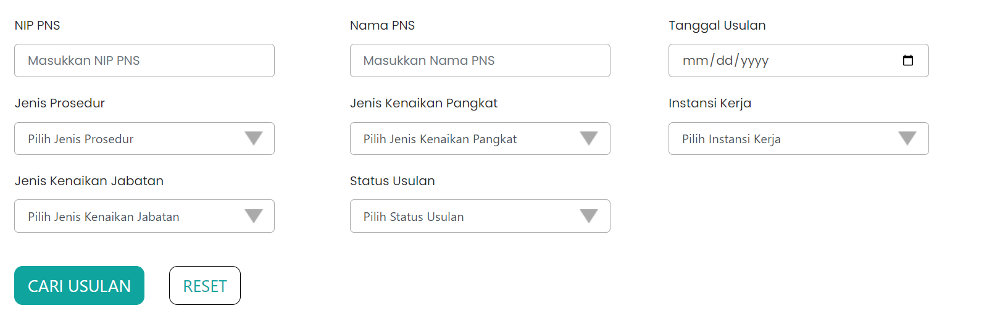

# Form Cari Usulan

Form cari usulan adalah bagian dari halaman Monitoring Paraf Pertek. 
Form cari usulan berguna untuk mencari
data usulan berdasarkan 
1. NIP PNS 
2. Nama PNS
3. Tanggal usulan
4. Jenis prosedur
5. Jenis kenaikan pangkat
6. Instansi kerja
7. Jenis kenaikan jabatan
8. Status usulan. 

Form cari usulan bukan termasuk custom komponen karena
dibuat menggunakan library `react-bootstrap`


```Berikut merupakan tampilan dari Form Menu Monitoring Paraf Pertek:```




### Struktur Komponen

Berikut adalah beberapa komponen dari library `react-bootstrap` yang
digunakan dalam membuat Form Cari Usulan.

| Library / Modul   | Komponen yang digunakan | Penjelasan                                                                                                                                   |
| ----------------- | ----------------------- | -------------------------------------------------------------------------------------------------------------------------------------------- |
| `react-bootstrap` | `Form`                  | `Form` digunakan untuk membuat form yang berfungsi sebagai tempat untuk menampung input data oleh user.                                      |
|                   | `Form.Label`            | `Form.Label` digunakan untuk membuat label pada suatu field yang diperuntukan untuk menginput data.                                          |
|                   | `Form.Control`          | `Form.Control` digunakan untuk membuat sebuah field input. `Form.Control` memiliki beberapa `type`, diantaranya `text`, `date`, dan `email`. |
|                   | `Form.Group`            | `Form.Group` digunakan untuk menggabungkan beberapa komponen yang terpisah pada form.                                                        |
|                   | `Row`                   | `Row` digunakan untuk membuat tampilan menjadi baris. Pada umumnya `Row` digunakan dengan `Col`.                                             |
|                   | `Col`                   | `Col` digunakan untuk mengatur konten di dalam `Row`.                                                                                        |
|                   | `Button`                | `Button` adalah komponen tombol pada `react-bootstrap` yang digunakan untuk membuat tombol yang dapat diklik                                 |

