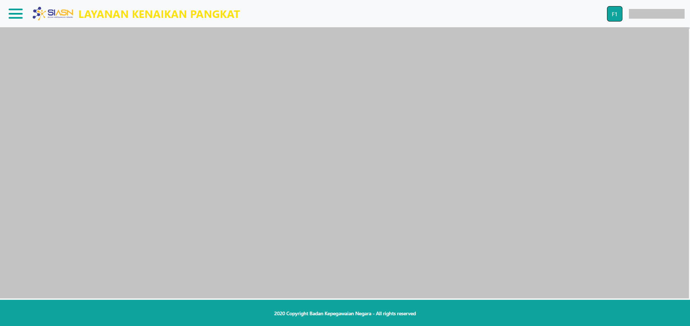

# Layout Monitoring Paraf Pertek

Layout merupakan kerangka pada website yang digunakan untuk mengatur tata letak 
halaman navigasi dan elemen lainnya pada website. Pada layout terdiri dari beberapa elemen yaitu elemen header, elemen sidebar dan elemen footer.


```Berikut merupakan tampilan dari Layout Menu Monitoring Paraf Pertek:```




### Struktur dan Komponen yang Digunakan

`Layout` memiliki struktur komponen sebagai berikut:

| Nama Komponen | Contoh Pemanggilan <br/> Komponen                                             | Properti/Atribut     | Tipe Data <br/> Atribut | Penjelasan                                                                                                                                                                                          |
| ------------- | ----------------------------------------------------------------------------- | -------------------- | ----------------------- | ------------------------------------------------------------------------------------------------------------------------------------------------------------------------------                      |
| Layout        | `<Layout>` <br/> &nbsp;&nbsp;&nbsp;&nbsp;&nbsp;`{children}` <br/> `</Layout>` | `children component` | `Any`                   |Layout digunakan sebagai <br/> pengatur atau untuk mengatur <br/> tampilan tata letak navigasi <br/> pada halaman website. <br/> Properti yang digunakan pada layout <br/> adalah Children Component |


