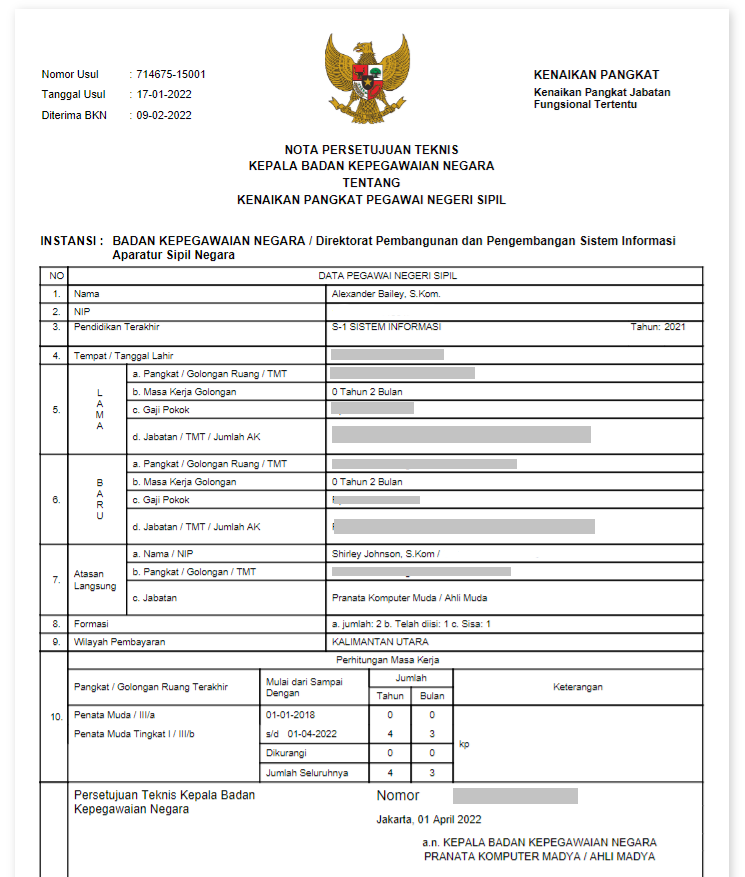

# Preview Dokumen Pertek

Bagian Preview Dokumen Persetujuan Teknis berisi dokumen
Pertek yang dibuat otomatis oleh Reporting Engine. Dokumen tersebut  
berisikan data usulan yang diajukan, 
selanjutnya dapat diunduh oleh ASN yang bersangkutan untuk diajukan.

```Berikut merupakan tampilan dari Preview Dokumen Pertek Menu Monitoring Paraf Pertek:```




### Struktur dan Komponen yang Digunakan

`PreviewDocPertekSK` memiliki struktur komponen sebagai berikut:

| Nama Komponen        | Contoh Pemanggilan <br/> Komponen                                                                                                                                                                                                          | Properti/Atribut   | Tipe Data <br/> Atribut | Penjelasan                                                                                                                                                                                               |
| -------------------  | ------------------------------------------------------------------------------------------------------------------------------------------------------------------------------------------------------------------------------------------ | ------------------ | ----------------------- | -------------------------------------------------------------------------------------------------------------------------------------------------------------------------------------------------------- |
| PreviewDocPertekSK   |`<PreviewDokPertekSK` <br/> &nbsp;&nbsp;&nbsp;&nbsp;&nbsp;`idUsul=` <br/> &nbsp;&nbsp;&nbsp;&nbsp;&nbsp;`{idUsul}` <br/> &nbsp;&nbsp;&nbsp;&nbsp;&nbsp;`path=` <br/> &nbsp;&nbsp;&nbsp;&nbsp;&nbsp;`{'kp/dokumen/pertek'}`<br/> `/>`        | `idUsul`           | `String`                | Properti `idUsul` berisi informasi <br/> id usulan yang akan digunakan untuk mengambil <br/> data yang diusulkan sebelumnya.                                                                       |
|                      |                                                                                                                                                                                                                                            | `path`             | `String`                | Properti path berisi path dari dokumen <br/> pertimbangan teknis (pertek) yang akan ditampilkan                                                                                                          |


