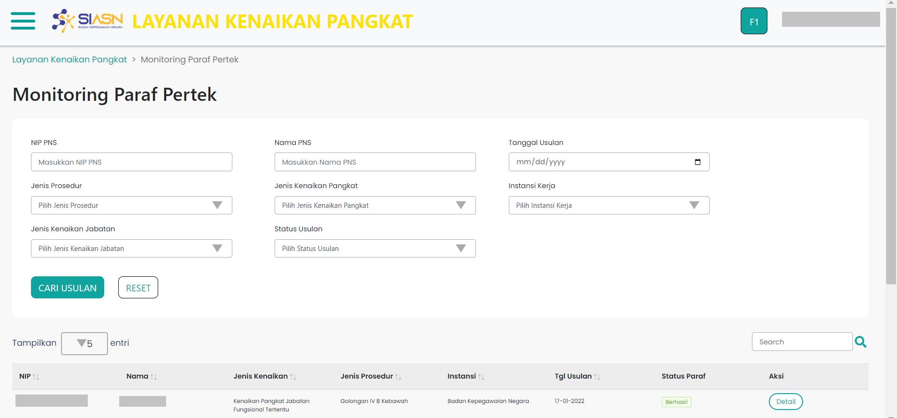

# Wizard First Monitoring Paraf Pertek

Wizard First merupakan custom component yang menampilkan halaman utama
dari menu monitoring paraf pertek. 
Halaman utama itu sendiri terdiri dari beberapa *section* yaitu:
* [Form Cari Usulan](/monitoring-paraf-pertek/formcari "title")
* [Tabel Data Usulan](/monitoring-paraf-pertek/tablempp "title")

```Berikut merupakan tampilan dari Wizard First Menu Monitoring Paraf Pertek:```



### Struktur dan Komponen yang Digunakan

`WizardFirstMPP` memiliki struktur komponen sebagai berikut:

| Nama Komponen         | Contoh Pemanggilan <br/> Komponen                  | Properti/Atribut   | Tipe Data <br/> Atribut | Penjelasan                                                                                                                                                                                               
| -------------         | ------------------------------------               | ------------------ | ----------------------- | -------------------------------------------------------------------------------------------------------------          |
| WizardFirstMPP        | `<WizardFirstMPP />`                               | -                  | -                       | WizardFirstMPP *component* berfungsi untuk <br/> menampilkan halaman utama pada menu monitoring paraf pertek           |


