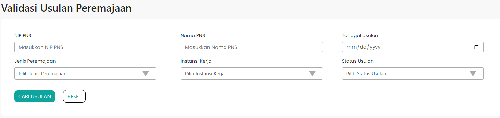

## NIP Baru
| Parameter | Type     | Description                |
| :-------- | :------- | :------------------------- |
|  | `string` | **Required**. Your API key |

## Environment Variables

To run this project, you will need to add the following environment variables to your .env file

## Screenshots

