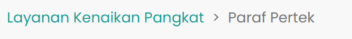

# Breadcrumb Paraf Pertek

### Tampilan Breadcrumb Paraf Pertek

Breadcrumb merupakan navigasi kecil yang berada dibagian atas
nama menu pada halaman sebuah website. Breadcrumb berfungsi untuk membantu users
mengetahui posisinya dalam situs web.

### Berikut adalah tampilan dari Breadcrumb Paraf Pertek

### Struktur dan Komponen yang Digunakan

| Nama Komponen         | Contoh Pemanggilan   Komponen                  | Properti/Atribut   | Tipe Data   Atribut | Penjelasan                                                                                                                                                                                               
| -------------         | ------------------------------------               | ------------------ | ----------------------- | ------------------------------------------------------------------------------------------------------                |
| BreadcrumbPP          | `<BreadcrumbPP />`                                 | -                  | -                       | BreadcrumbPP berfungsi untuk   membantu user mengetahui    posisinya dalam situs web.                        |

