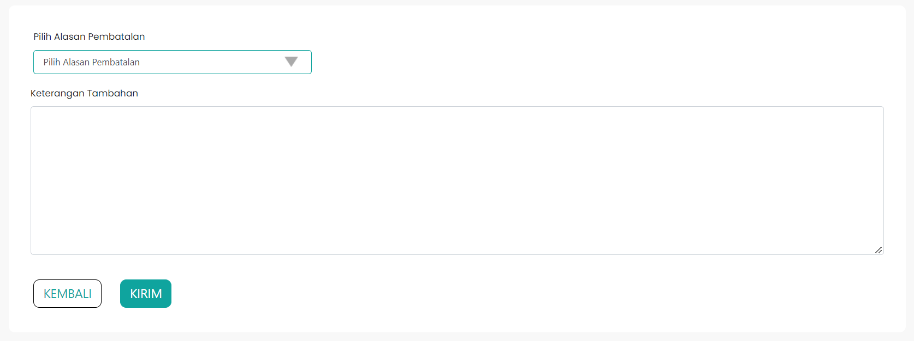
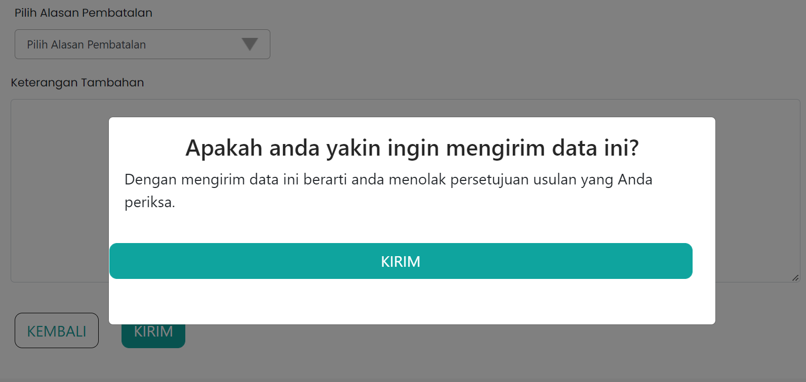

# Form Tolak Usulan

Pada proses pengajuan usulan paraf pertimbangan teknis (pertek)
terdapat opsi untuk menolak pengajuan pertek. Proses penolakan pertek 
ini terjadi karena beberapa faktor atau alasan. Faktor terjadinya penolakan tersebut
diantara lain yaitu karena berkas tidak terlampiratau salah unggah,
melampaui pangkat atasan langsung dan lain sebagainya.

Form tolak pertek menjelaskan proses pembatalan usulan yang telah 
diajukan sebelumnya untuk usulan kenaikan pangkat. Halaman ini juga menampilkan
card informasi ASN yang mengajukan usulan kenaikan pangkat dan terdapat
pilihan alasan untuk pembatalan serta keterangan tambahannya.

Alasan pembatalan yang tersedia diantaranya:

* Berkas tidak terlampir atau salah unggah
* Melampaui pangkat atasan langsung
* SKP bernilai cukup
* Angka kredit tidak mencukupi
* dan sebagainya

```Berikut merupakan tampilan dari Form Tolak Usulan Menu Paraf Pertek:```




```Berikut merupakan tampilan dari Modal Form Tolak Usulan Menu Paraf Pertek:```



### Struktur Komponen

Berikut adalah beberapa komponen
dari library `react-bootstrap` yang
digunakan dalam membuat Form Tolak Usulan.

| Library / Modul   | Komponen yang digunakan | Penjelasan                                                                                                                                              |
| ----------------- | ----------------------- | ------------------------------------------------------------------------------------------------------------------------------------------------------- |
| `react-bootstrap` | `Form`                  | `Form` digunakan untuk membuat form yang berfungsi sebagai tempat untuk menampung input data oleh user.                                                 |
|                   | `Form.Label`            | `Form.Label` digunakan untuk membuat label pada suatu field yang diperuntukan untuk menginput data.                                                     |
|                   | `Form.Control`          | `Form.Control` digunakan untuk membuat sebuah field input. `Form.Control` memiliki beberapa `type`, diantaranya `text`, `date`, dan `email`.            |
|                   | `Form.Group`            | `Form.Group` digunakan untuk menggabungkan beberapa komponen yang terpisah pada form.                                                                   |
|                   | `Row`                   | `Row` digunakan untuk membuat tampilan menjadi baris. Pada umumnya `Row` digunakan dengan `Col`.                                                        |
|                   | `Col`                   | `Col` digunakan untuk mengatur konten di dalam `Row`.                                                                                                   |
|                   | `Modal`                 | `Modal` adalah komponen yang telah dibuat oleh `react-bootstrap` berupa sebuah pop-up content yang didalamnya dapat kita gunakan untuk membuat tampilan |
|                   | `Button`                | `Button` adalah komponen tombol pada `react-bootstrap` yang digunakan untuk membuat tombol yang dapat diklik.                                           |


