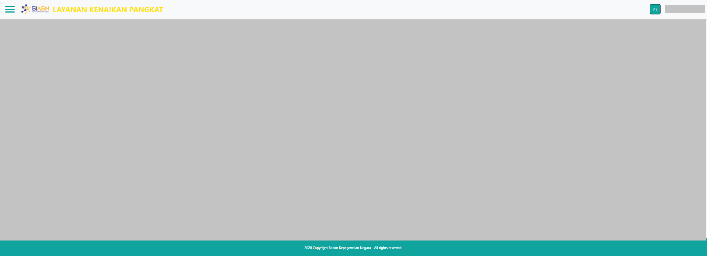

# Layout Paraf Pertek

Layout merupakan kerangka pada website yang digunakan untuk mengatur tata letak 
halaman navigasi dan elemen lainnya pada website. 
Pada komponen layout terdiri dari beberapa elemen yaitu elemen header dan elemen footer.

### Berikut adalah tampilan dari Layout Paraf Pertek

### Struktur dan Komponen yang Digunakan

| Nama Komponen | Contoh Pemanggilan   Komponen                                             | Properti/Atribut     | Tipe Data   Atribut | Penjelasan                                                                                                                                                                                          |
| ------------- | ----------------------------------------------------------------------------- | -------------------- | ----------------------- | ------------------------------------------------------------------------------------------------------------------------------------------------------------------------------                      |
| Layout        | `<Layout>`   &nbsp;&nbsp;&nbsp;&nbsp;&nbsp;`{children}`   `</Layout>` | `children component` | `Any`                   |Layout digunakan sebagai   pengatur atau untuk mengatur   tampilan tata letak navigasi   pada halaman website.   Properti yang digunakan pada layout   adalah Children Component |

