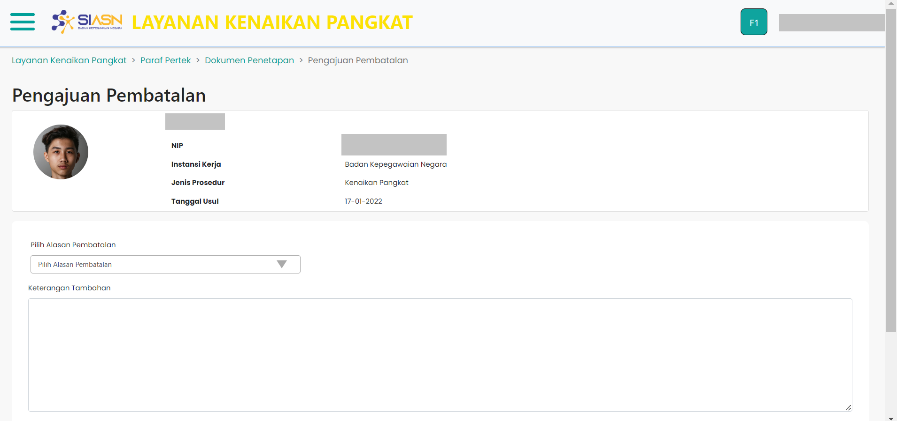

# Pengajuan Pembatalan

Pengajuan Pembatalan merupakan *custom component* yang digunakan untuk
menampilkan halaman pengajuan pembatalan pada menu monitoring paraf pertek.


```Berikut merupakan tampilan dari Pengajuan Pembatalan Menu Paraf Pertek:```




### Struktur Komponen Pengajuan Pembatalan

`PengajuanPembatalan` memiliki struktur komponen sebagai berikut:

| Nama Komponen         | Contoh Pemanggilan <br/> Komponen                                                                                              | Properti/Atribut | Tipe Data <br/> Atribut | Penjelasan                                                                                                                                       |
| --------------------- | ------------------------------------------------------------------------------------------------------------------------------ | ---------------- | ----------------------- | ------------------------------------------------------------------------------------------------------------------------------------------------ |
| PengajuanPembatalan   | `<PengajuanPembatalan>` <br/> &nbsp;&nbsp;&nbsp;&nbsp;&nbsp; <br/> `</PengajuanPembatalan>`                                    | -                | -                       | PengajuanPembatalan merupakan *component* <br/>  yang digunakan untuk menampilkan halaman <br/> pengajuan pembatalan pada menu paraf pertek.     |


