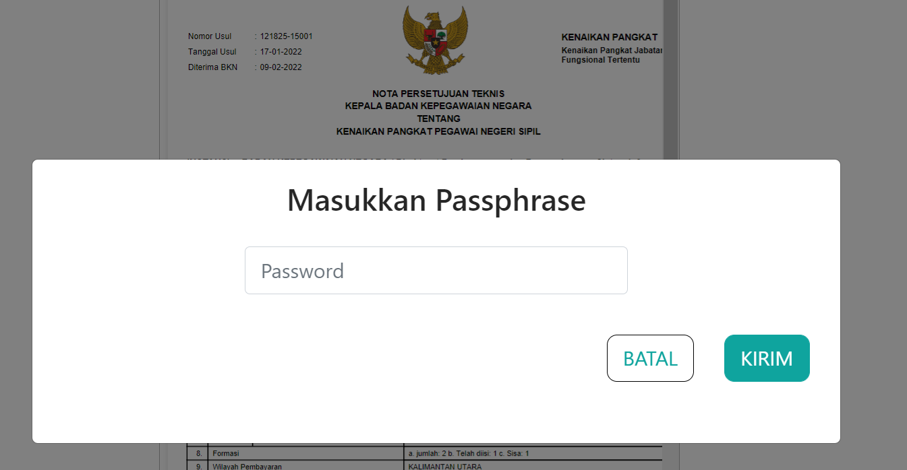

# Persetujuan Pertek

Persetujuan Pertek merupakan form untuk persetujuan pengajuan paraf pertek yang divalidasi menggunakan password.
Pada step ini bagian yang bersangkutan memasukkan password yang valid untuk memvalidasi persetujuan paraf pertek.

### Struktur dari Komponen yang digunakan:

| Nama Komponen      | Contoh Pemanggilan   Komponen                                                                                              | Properti/Atribut | Tipe Data   Atribut | Penjelasan                                                                                                                                                                      |
| -------------      | ------------------------------------------------------------------------------------------------------------------------------ | ---------------- | ----------------------- | -----------------------------------------------------------------------------------------------------------------------------------------------------------------               |
| DigitalSignature   | `<DigitalSignature`   &nbsp;&nbsp;&nbsp;&nbsp;&nbsp;`idUsul=`   &nbsp;&nbsp;&nbsp;&nbsp;&nbsp;`{idUsul}`   `/>`    | `idUsul`         | `Object`                | Properti idUsul berisi id nilai usulan yang dikirim.   Nilai id tersebut digunakan sebagai kondisi apakah password   yang dimasukkan bernilai benar atau salah.         |

