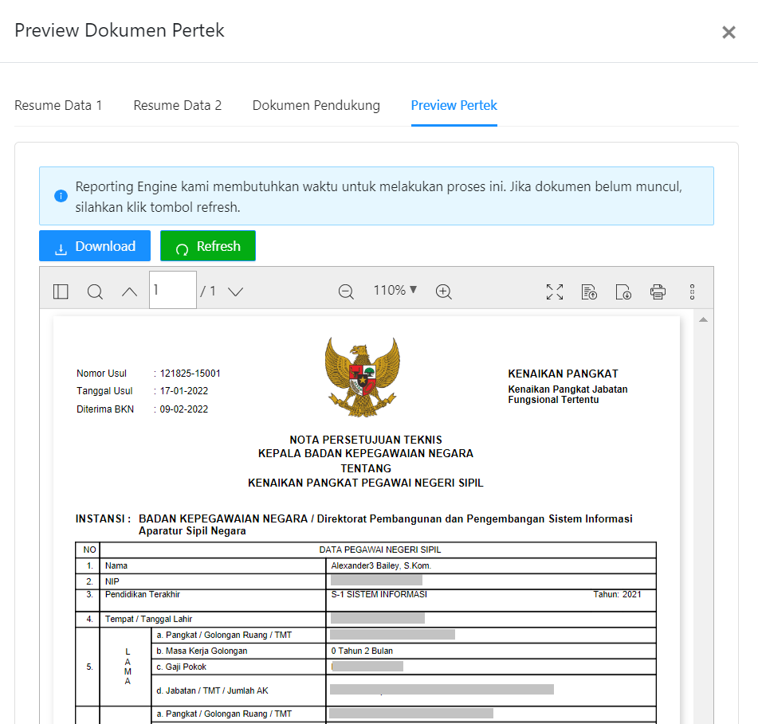

# Preview Dokumen Pertek

Bagian Preview Dokumen Persetujuan Teknis berisi dokumen
Pertek yang dibuat otomatis oleh Reporting Engine yang
nantinya dapat diunduh oleh ASN yang bersangkutan untuk diajukan.


```Berikut merupakan tampilan dari Preview Dokumen Persetujuan Teknis Menu Paraf Pertek:```


### Struktur dari komponen Preview Dokumen Pertek adalah:

`TablePP2` memiliki struktur komponen sebagai berikut:

| Nama Komponen        | Contoh Pemanggilan <br/> Komponen                                                                                                                                                                                                          | Properti/Atribut   | Tipe Data <br/> Atribut | Penjelasan                                                                                                                                                                                               |
| -------------        | ------------------------------------------------------------------------------------------------------------------------------------------------------------------------------------------------------------------------------------------ | ------------------ | ----------------------- | -------------------------------------------------------------------------------------------------------------------------------------------------------------------------------------------------------- |
| PreviewDocPertekSK   |`<PreviewDocPertekSK` <br/> &nbsp;&nbsp;&nbsp;&nbsp;&nbsp;`idUsul=` <br/> &nbsp;&nbsp;&nbsp;&nbsp;&nbsp;`{idUsul}` <br/> &nbsp;&nbsp;&nbsp;&nbsp;&nbsp;`path=` <br/> &nbsp;&nbsp;&nbsp;&nbsp;&nbsp;`{'kp/dokumen/pertek'}`<br/> `/>`        | `idUsul`           | `String`                | Properti idUsul berisi informasi id usulan <br/> yang akan digunakan untuk mengambil <br/> data yang diusulkan sebelumnya.                                                                               |
|                      |                                                                                                                                                                                                                                            | `path`             | `String`                | Properti path berisi path dari dokumen pertimbangan  <br/> teknis (pertek) yang akan ditampilkan                                                                                                         |                                                                                                                                           


