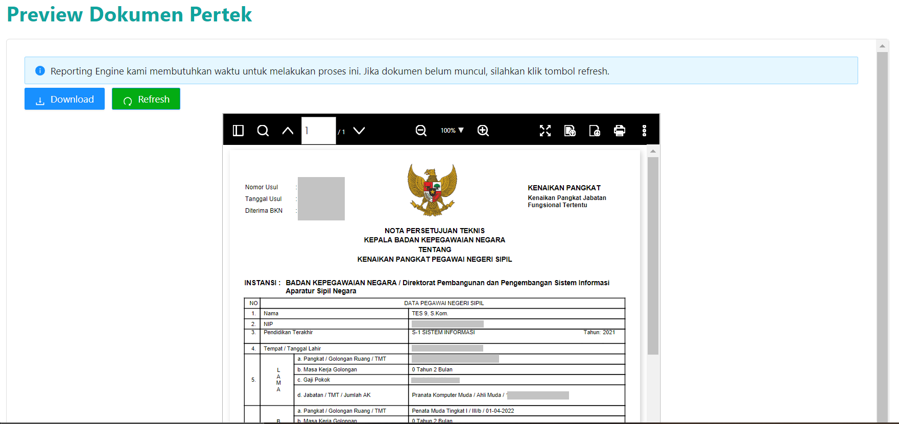

# Preview Dokumen Pertek

Bagian Preview Dokumen Persetujuan Teknis berisi dokumen
Pertek yang dibuat otomatis oleh Reporting Engine yang
nantinya dapat diunduh oleh ASN yang bersangkutan untuk diajukan.

```Berikut merupakan tampilan dari Preview Dokumen Persetujuan Teknis Menu Paraf Pertek:```


### Struktur dari komponen Preview Dokumen Pertek adalah:

`TablePP2` memiliki struktur komponen sebagai berikut:

| Nama Komponen    | Contoh Pemanggilan <br/> Komponen                                                                                           | Properti/Atribut | Tipe Data <br/> Atribut | Penjelasan                                                                                                                                                                        |
| ---------------- | --------------------------------------------------------------------------------------------------------------------------- | ---------------- | ----------------------- | --------------------------------------------------------------------------------------------------------------------------------------------------------------------------------  |
| PreviewDokPertek | `<PreviewDokPertek` <br/> &nbsp;&nbsp;&nbsp;&nbsp;&nbsp;`idUsul=` <br/> &nbsp;&nbsp;&nbsp;&nbsp;&nbsp;`{idUsul}` <br/> `/>` | `idUsul`         | `String`                | Properti `idUsul`berisikan informasi berdasarkan <br/> id usulan yang diajukan. Id usulan tersebut akan <br/> digunakan sebagai acuan dalam mengambil <br/>  data Dokumen Pertek. |


