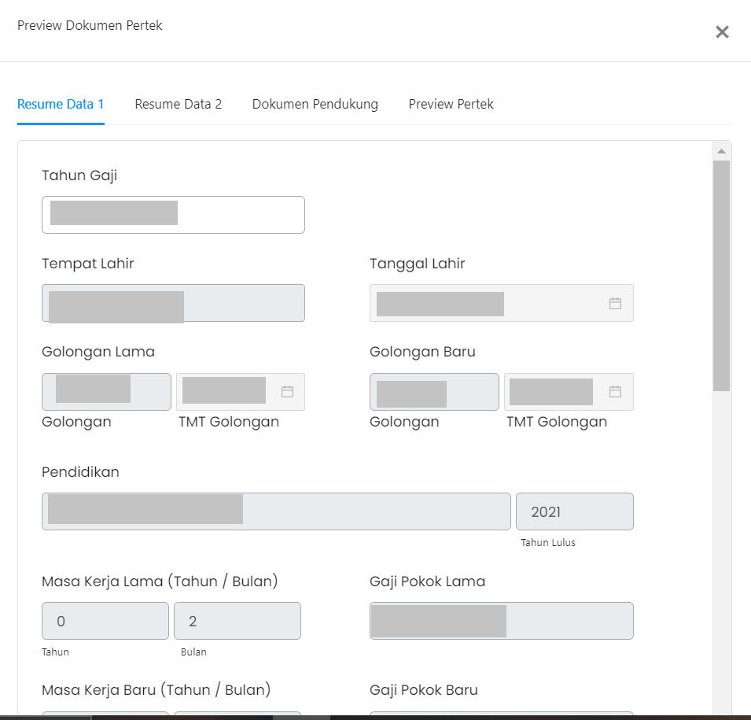

# Resume Data 1

Resume Data 1 berisi informasi data diri tentang golongan ASN,
pendidikan terakhir ASN, masa kerja,
jenis jabatan, masa kerja, serta informasi mengenai lembaga tempat ASN
bekerja.

### Berikut adalah tampilan dari Resume Data 1

### Struktur dari Komponen Tab Resume Data 1 adalah:

| Nama Komponen | Contoh Pemanggilan   Komponen                                                                                              | Properti/Atribut | Tipe Data   Atribut | Penjelasan                                                                                                                        |
| ------------- | ------------------------------------------------------------------------------------------------------------------------------ | ---------------- | ----------------------- | -------------------------------------------------------------------------------------------------------------                     |
| ResumeData1   | `<ResumeData1`   &nbsp;&nbsp;&nbsp;&nbsp;&nbsp;`dataUsulan=`   &nbsp;&nbsp;&nbsp;&nbsp;&nbsp;`{dataUsulan}`   `/>` | `dataUsulan`     | ` Object`               | Properti dataUsulan berisi informasi   data diri ASN muali dari pendidikan, jenis jabatan,   dan dokumen-dokumen lainnya  |

