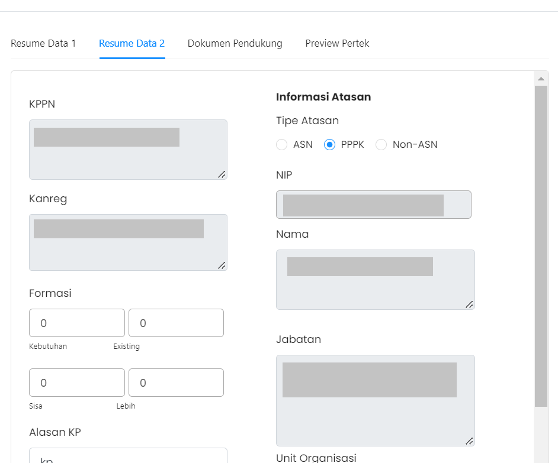

# Resume Data 2

Resume Data 2 berisi informasi tentang
Kantor Pelayanan Perbendaharaan Negara (KPPN),
Kantor Regional (Konreg) 
atasan pada lembaga tempat ASN yang bersangkutan bekerja, serta
alasan kenaikan pangkat.

### Berikut adalah tampilan dari Resume Data 2

### Struktur dari Komponen Tab Resume Data 2 adalah:

| Nama Komponen        | Contoh Pemanggilan   Komponen                                                                                                                                                                                                          | Properti/Atribut   | Tipe Data   Atribut | Penjelasan                                                                                                                                                                                               |
| -------------        | ------------------------------------------------------------------------------------------------------------------------------------------------------------------------------------------------------------------------------------------ | ------------------ | ----------------------- | -------------------------------------------------------------------------------------------------------------------------------------------------------------------------------------------------------- |
| ResumeData2          |`<ResumeData2`   &nbsp;&nbsp;&nbsp;&nbsp;&nbsp;`dataUsulan=`   &nbsp;&nbsp;&nbsp;&nbsp;&nbsp;`{dataUsulan}`   &nbsp;&nbsp;&nbsp;&nbsp;&nbsp;`tipeForm=`   &nbsp;&nbsp;&nbsp;&nbsp;&nbsp;`{'view'}`  `/>`                | `dataUsulan`       | `Object`                | Properti dataUsulan berisi informasi   dari ASN seperti KPPN, Kanreg,   hingga dokumen-dokumen usulan lainnya.                                                                                   |
|                      |                                                                                                                                                                                                                                            | `tipeForm`         | `String`                | Properti tipeForm bertipe data string, berguna   untuk menampilkan form data dari informasi atasan.   Properti ini digunakan sebagai syarat dari kondisi.                                        |                                                                                                                                           
