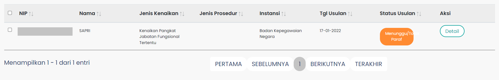

# Teble Paraf Pertek

Tabel Paraf Pertek (TablePP) merupakan tampilan tabel yang menampilkan data monitoring untuk
paraf pertek sebagai salah satu syarat usulan kenaikan pangkat untuk ASN. Pada tabel ini akan ditampilkan
data yang lebih spesifikasi setelah user melakukan pencarian data usulan.

### Berikut adalah tampilan dari Table Monitoring Paraf Pertek

### Struktur dan Komponen yang Digunakan

| Nama Komponen | Contoh Pemanggilan   Komponen                                                                                                                                                                                                          | Properti/Atribut   | Tipe Data   Atribut | Penjelasan                                                                                                                                                                                               |
| ------------- | ------------------------------------------------------------------------------------------------------------------------------------------------------------------------------------------------------------------------------------------ | ------------------ | ----------------------- | -----------------------------------------------------------------------------------------------------------------                      |
| TablePP       | `<TablePP`   &nbsp;&nbsp;&nbsp;&nbsp;&nbsp; `dataTable`=   &nbsp;&nbsp;&nbsp;&nbsp;&nbsp; `{data}`   `/>`                                                                                                                      | `dataTable`        | `Array`                 | dataTable bertipe   Array yang digunakan    untuk menerima   data yang akan   ditampilkan pada tabel               |

