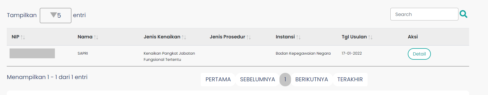

# Tebel Paraf Pertek 2

Tabel Paraf Pertek (TablePP2) merupakan tampilan tabel yang menampilkan data monitoring untuk
paraf pertek sebagai salah satu syarat usulan kenaikan pangkat untuk ASN. Pada tabel ini akan ditampilkan
data yang lebih spesifikasi setelah user melakukan pencarian data usulan. Tabel tersebut berisi data PNS meliputi NIP, Nama, Jenis Kenaikan, Jenis Prosedur, Instansi, Tanggal Usulan, 
hingga Status Paraf.

### Berikut adalah tampilan dari Table Monitoring Paraf Pertek

### Struktur dan Komponen yang Digunakan

| Nama Komponen | Contoh Pemanggilan   Komponen                                                                                                                                                                                                          | Properti/Atribut   | Tipe Data   Atribut | Penjelasan                                                                                                                                                                                                                                            |    
| ------------- | ------------------------------------------------------------------------------------------------------------------------------------------------------------------------------------------------------------------------------------------ | ------------------ | ----------------------- | -----------------------------------------------------------------------------------------------------------------                                                                                                                                     |
| TablePP2      | `<TablePP2`   &nbsp;&nbsp;&nbsp;&nbsp;&nbsp; `dataTable`=   &nbsp;&nbsp;&nbsp;&nbsp;&nbsp; `{getTekenUsul}`   `/>`                                                                                                             | `dataTable`        | `Array`                 | dataTable bertipe   Array yang digunakan   untuk menerima   data yang akan   ditampilkan pada tabel.   Data yang akan ditampilkan   merupakan data yang sesuai dengan   data yang diinput   oleh user dari form data usulan.                  |

