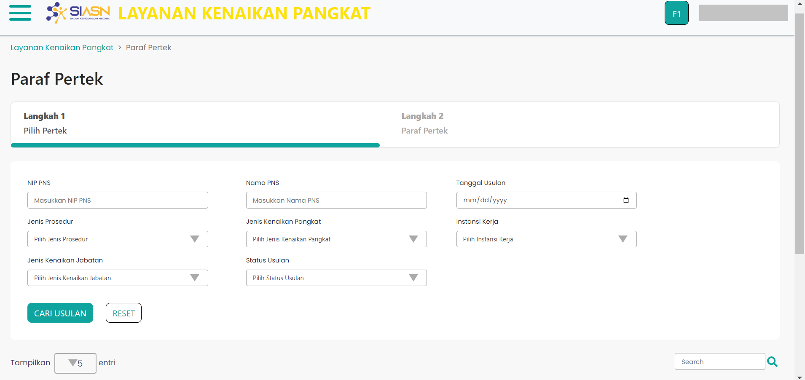

# Wizard First

Wizard First merupakan *custom component* yang digunakan untuk
menampilkan halaman utama pada menu monitoring paraf pertek. 
Halaman utama itu sendiri terdiri dari beberapa *section* yaitu:
* [Form Cari Usulan](/paraf-pertek/form-cari-usulan "title")
* [Tabel Data Usulan](/paraf-pertek/tabelpp "title")

### Berikut adalah tampilan dari Wizard First

### Struktur Komponen Wizard First

`PengajuanPembatalan` memiliki struktur komponen sebagai berikut:

| Nama Komponen         | Contoh Pemanggilan   Komponen                                                                                              | Properti/Atribut | Tipe Data   Atribut | Penjelasan                                                                                                                                 |
| --------------------- | ------------------------------------------------------------------------------------------------------------------------------ | ---------------- | ----------------------- | ------------------------------------------------------------------------------------------------------------------------------------------ |
| WizardFirstPP         | `<WizardFirstPP>`   &nbsp;&nbsp;&nbsp;&nbsp;&nbsp;   `</WizardFirstPP>`                                                | -                | -                       | WizardFirst merupakan *custom component*   yang digunakan untuk menampilkan halaman utama    pada menu monitoring paraf pertek.   |

