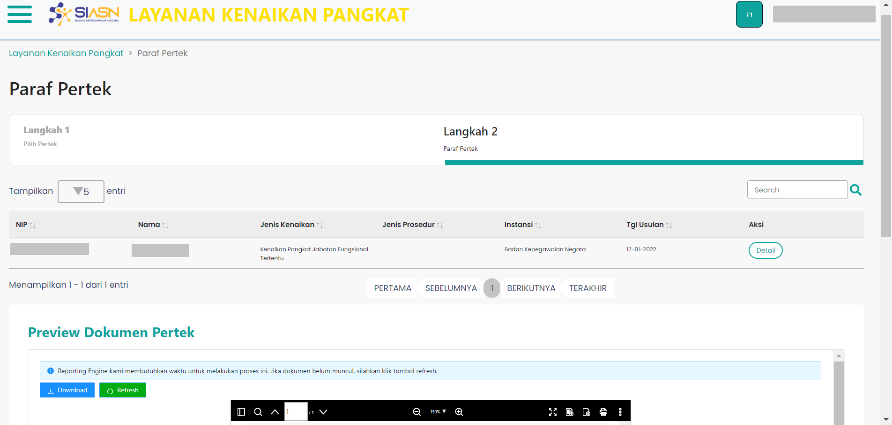

# Wizard Second

Wizard Second merupakan *custom component* yang digunakan untuk
menampilkan halaman Selanjutnya pada menu paraf pertek. 
Halaman langkah kedua itu sendiri terdiri dari beberapa *section* yaitu:
* [Tabel Data Usulan](/paraf-pertek/tabelpp "title")
* [Preview Dokumen Pertek](/paraf-pertek/preview-dok-pertek2 "title")
* [Tolak Usulan Pengajuan](/paraf-pertek/form-tolak-usulan "title")
* [Persetujuan Usulan](/paraf-pertek/persetujuan-pertek "title")

### Berikut adalah tampilan dari Wizard Second

### Struktur Komponen Wizard Second

`PengajuanPembatalan` memiliki struktur komponen sebagai berikut:

| Nama Komponen         | Contoh Pemanggilan   Komponen                                                                                              | Properti/Atribut | Tipe Data   Atribut | Penjelasan                                                                                                                                                         |
| --------------------- | ------------------------------------------------------------------------------------------------------------------------------ | ---------------- | ----------------------- | ------------------------------------------------------------------------------------------------------------------------------------------------------------------ |
| WizardSecondPP        | `<WizardSecondPP>`   &nbsp;&nbsp;&nbsp;&nbsp;&nbsp;   `</WizardSecondPP>`                                              | -                | -                       |  WizardSecondPP merupakan *custom component*   yang digunakan untuk menampilkan halaman selanjutnya   (langkah kedua) pada menu paraf pertek.              |

