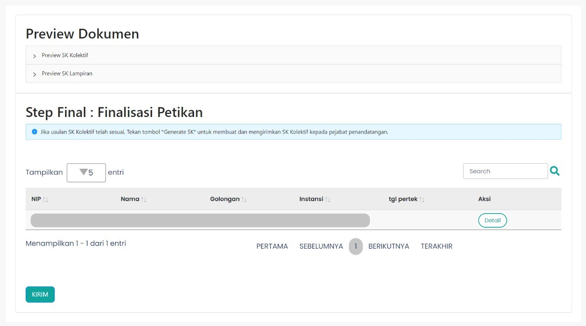

# Step Four Component

`StepFour` merupakan *custom component* yang berisi *value* dari *key* `content` pada `component fields`. 

#### `StepFour` disusun atas beberapa *section*, yaitu 
* Preview Dokumen yang terdiri dari Preview SK Kolektif dan Preview SK Lampiran 
* Tabel Finalisasi Petikan

<br/>

```Berikut merupakan tampilan dari halaman Pembuatan SK Kolektif Tahap 4```


### Component Structure

`StepFour` memiliki struktur komponen sebagai berikut. 

| Nama Komponen | Contoh Pemanggilan <br/> Komponen | Properti/Atribut | Tipe Data <br/> Atribut | Penjelasan |
| ------------- | :---------------------------------| ---------------- | ----------------------- | -----------|
|`StepFour`     | `<StepFour />`                    | -                | -                       | `StepFour` berisi semua <br/> konten yang ada pada <br/> menu halaman Pembuatan <br/> SK Kolektif Tahap 4. |

