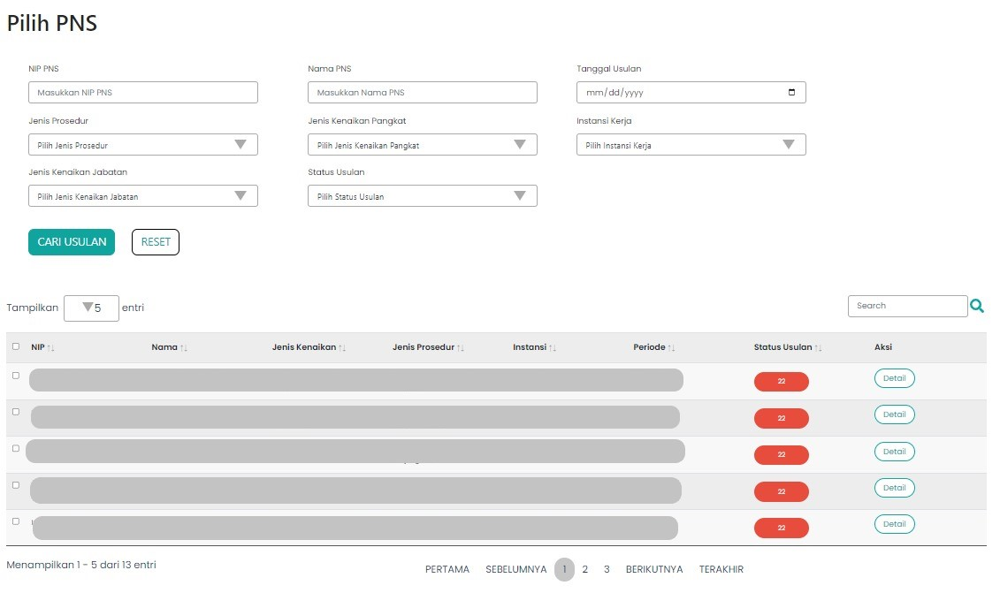

# Step One Component

`StepOne` merupakan *custom component* yang berisi *value* dari *key* `content` pada  `component fields`. 

#### `StepOne` disusun atas beberapa *section*, yaitu 
* [Form Cari Usulan](/docs-pembuatan-sk-kolektif-form-cari-usulan "title")
* [Tabel Surat Usulan](/docs-pembuatan-sk-kolektif-table-step-1 "title")


```Berikut merupakan tampilan dari halaman Pembuatan SK Kolektif Tahap 1```


### Component Structure

`StepOne` memiliki struktur komponen sebagai berikut. 

| Nama Komponen | Contoh Pemanggilan <br/> Komponen | Properti/Atribut | Tipe Data <br/> Atribut | Penjelasan |
| ------------- | :---------------------------------| ---------------- | ----------------------- | -----------|
|`StepOne`      | `<StepOne />`                     | -                | -                       | `StepOne` berisi semua <br/> konten yang ada pada <br/> menu halaman Pembuatan <br/> SK Kolektif Tahap 1. |