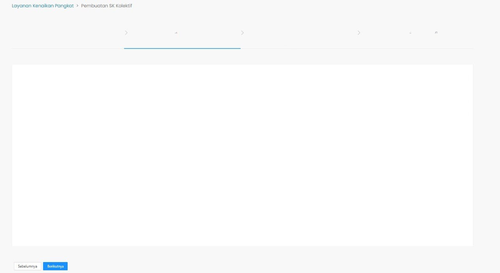

# Step SK Kolektif 
Step SK kolektif adalah *component* pertama yang akan ditampilkan ketika menu pembuatan SK kolektif dibuka dan 
merupakan salah satu *child component* dari [layout](/docs-pembuatan-sk-kolektif-layout "title"). 
Step SK kolektif ini berfungsi sebagai kerangka dasar dari setiap halaman yang akan ditampilkan pada 
menu pembuatan SK kolektif, yang terdiri dari dua komponen berikut.
* [Breadcrumb](/docs-pembuatan-sk-kolektif-breadcrumb "title")
* [CustomSteps](/docs-pembuatan-sk-kolektif-customsteps "title")

<br/>

```Berikut merupakan tampilan dari Step SK Kolektif```



### Component Structure

`StepSKKolektif` memiliki struktur komponen sebagai berikut. 

| Nama Komponen        | Contoh Pemanggilan <br/> Komponen | Properti/Atribut | Tipe Data <br/> Atribut | Penjelasan |
| ---------------------| :---------------------------------| ---------------- | ----------------------- | -----------|
|`StepSKKolektif`      | `<StepSKKolektif />`              | -                | -                       | `StepSKKolektif` berfungsi sebagai <br/> kerangka dasar dari setiap <br/> halaman yang akan ditampilkan <br/> pada menu pembuatan SK <br/> kolektif |


