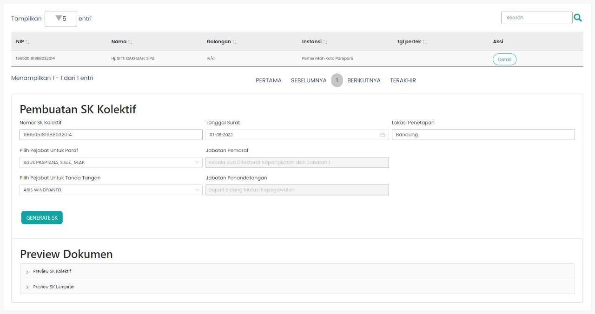

# Step Two Component

`StepTwo` merupakan *custom component* yang berisi *value* dari *key* `content` pada  `component fields`.
`StepTwo` berisi semua konten yang ada pada menu halaman Pembuatan SK Kolektif Tahap 2.

#### `StepTwo` disusun atas beberapa *section*, yaitu 
* [Tabel Surat Usulan](/docs-pembuatan-sk-kolektif-table-step-1) yang telah dipilih pada [Tahap 1](/docs-pembuatan-sk-kolektif-step-one)
* [Form Pembuatan SK Kolektif](/docs-pembuatan-sk-kolektif-step-one)
* [Preview Dokumen](/docs-pembuatan-sk-kolektif-tab-preview-doc-pertek-sk) yang terdiri dari Preview SK Kolektif dan Preview SK Lampiran 

<br/>  

```Berikut merupakan tampilan dari halaman Pembuatan SK Kolektif Tahap 2```


### Component Structure

`StepTwo` memiliki struktur komponen sebagai berikut. 

| Nama Komponen | Contoh Pemanggilan <br/> Komponen | Properti/Atribut | Tipe Data <br/> Atribut | Penjelasan |
| ------------- | :---------------------------------| ---------------- | ----------------------- | -----------|
|`StepTwo`      | `<StepTwo />`                     | -                | -                       | `StepTwo` berisi semua <br/> konten yang ada pada <br/> menu halaman Pembuatan <br/> SK Kolektif Tahap 2.|