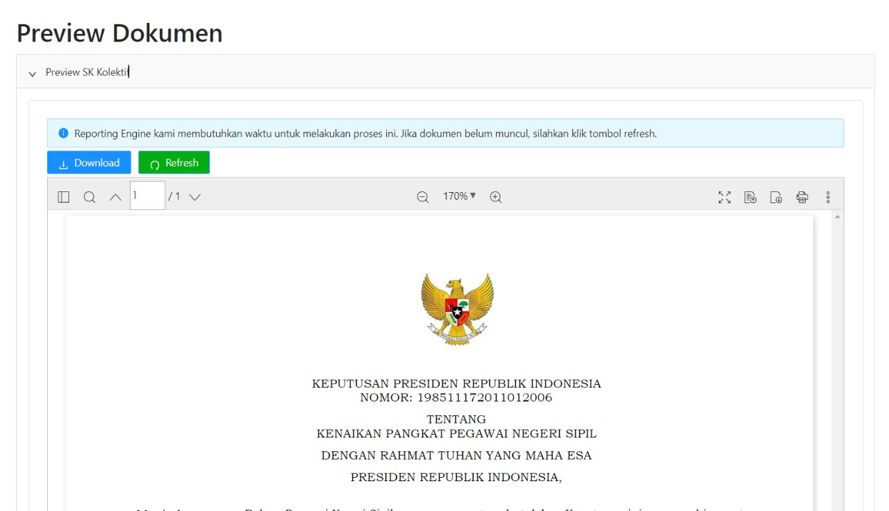

# Preview Dokumen

Preview Dokumen merupakan salah satu modal yang berada pada kolom aksi pada [Tabel Surat Usulan](/docs-pembuatan-sk-kolektif-table-step-1 "title"). 
Preview Dokumen ini juga terdapat pada pada halaman [Tahap 2](/docs-pembuatan-sk-kolektif-step-two "title") dan 
[Tahap 4](/docs-pembuatan-sk-kolektif-step-four "title").
Preview Dokumen berisi detail dari dokumen milik ASN, seperti dokumen pertimbangan teknis, SK kolektif, SK lampiran, dan SK petikan.

<br/>

```Berikut merupakan tampilan dari halaman Preview Document```


### Component Structure

| Nama Komponen        | Contoh Pemanggilan <br/> Komponen                                                                                                                                                      | Properti/Atribut | Tipe Data <br/> Atribut | Penjelasan                                                                                                                        |
| -------------        | ---------------------------------------------------------------------------------------------------------------------------------------------------------------------------------------|------------------| ------------------------|-----------------------------------------------------------------------------------------------------------------------------------|
| `PreviewDocPertekSK` | `<PreviewDocPertekSK` <br/> &nbsp;&nbsp;&nbsp;&nbsp; `idUsul=`  <br/> &nbsp;&nbsp;&nbsp;&nbsp; `{props?.idUsul}` <br/> &nbsp;&nbsp;&nbsp;&nbsp; `path='kp/dokumen/pertek'` <br/> `/>`  | `idUsul`         | `number`                | `idUsul` merupakan atribut <br/> yang berisi informasi <br/> id usulan yang diajukan dan <br/> akan digunakan sebagai acuan <br/> untuk mengambil data Dokumen <br/> Pertimbangan Teknis berdasarkan id <br/> usulan yang diajukan |
|                      |                                                                                                                                                                                        | `path`           | `string`                | `path` merupakan atribut yang <br/> berisi path dari file <br/> dokumen yang akan ditampilkan. |