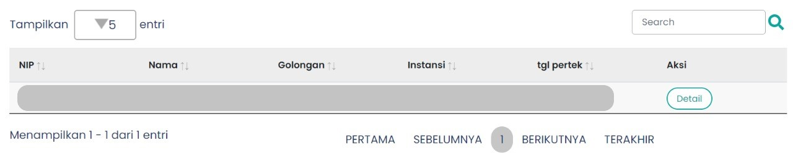

# Table Pembuatan SK Kolektif

Table pembuatan SK kolektif merupakan tabel yang terdapat pada halaman Tahap 2, Tahap 3, Tahap 4 yang menampilkan data ASN yang telah dipilih oleh admin SI-ASN BKN untuk dilakukan pembuatan SK kolektif. Tabel ini
berisi data ASN yang telah dipilih pada Table Surat Usulan.

<br/>

```Berikut merupakan tampilan dari Table Pembuatan SK Kolektif```


### Component Structure

`Table Pembuatan SK Kolektif` memiliki struktur komponen sebagai berikut.

| Nama Komponen | Contoh Pemanggilan <br/> Komponen                                                                                                                                                            | Properti/Atribut | Tipe Data <br/> Atribut | Penjelasan                                                                                                                                     |
| ------------- | -------------------------------------------------------------------------------------------------------------------------------------------------------------------------------------------- | ---------------- | ----------------------- | -----------------------------------------------------------------------------------------------------------------------------------------------|
| TableStep2    | `<TableStep2` <br/> &nbsp;&nbsp;&nbsp;&nbsp; `dataTable={dataTable ?` <br/> &nbsp;&nbsp;&nbsp;&nbsp; `dataTable : []}` <br/> &nbsp;&nbsp;&nbsp;&nbsp; `step={2}>` <br/> `</TableStep2>`      | `dataTable`      | `object`                | `dataTable` merupakan atribut <br/> yang menampung data ASN <br/> yang telah dipilih pada <br/> Table Surat Usulan.     |
|               |                                                                                                                                                                                              | `step`           | `number`                | `step` merupakan atribut yang <br/> menyimpan data halaman <br/> tahapan yang akan <br/> ditampilkan. Pada hal ini <br/> `step` bernilai 2, di mana <br/> berarti Table Pembuatan <br/>  SK Kolektif ini ditampilkan <br/> pada halaman Tahap 2|
