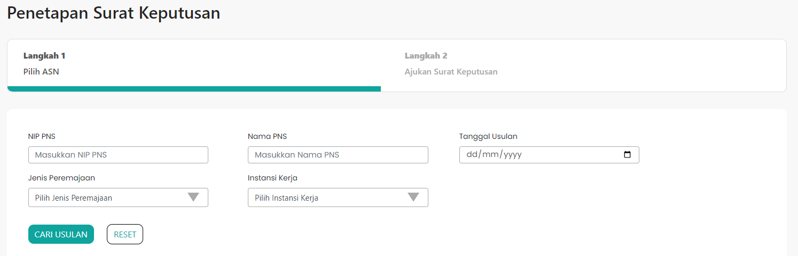

# Penetapan SK (Surat Keputusan)

Untuk melakukan pencarian data PNS berdasarkan form yang tersedia.

`Penetapan SK` memiliki struktur Komponen sebagai berikut:

| Library / Modul   | Komponen yang digunakan                | Properti/Atribut | Penjelasan                                                                                                                                                                                                                                                                                                                                                            |
| ----------------- | -------------------------------------- | ---------------- | --------------------------------------------------------------------------------------------------------------------------------------------------------------------------------------------------------------------------------------------------------------------------------------------------------------------------------------------------------------------- |
| `Layout`          | `<Layout>`                             | `-`              | `<Layout>` Merupakan library buatan dari component yang lain yang berfungsi sebagai pngecekan token,   jika tidak ada token makan user akan dialihkan ke halaman utama.                                                                                                                                                                                           |
| `react-bootstrap` | `{ Form, Col, Button, Dropdown, Row }` | `-`              | `react-bootstrap` Merupakan library dari bootstrap khusus untuk react,   `<Form>` Sebagai pembentuk element Form dengan styling bawaan bootstrap,   `<Col>` Merupakan komponen untuk membuat kolom,   `<Button>` Merupakan komponen untuk membuat Button dengan styling,   `<Dropdown>` Untuk membuat menu drop down,  `<Row>` Untuk membuat Row. |
| `react`           | `React, { useState, useEffect }`       | `-`              | `react` Merupakan library react,   `useState` digunakan untuk menyimpan dan mengatur state data pada halaman,   `useEffect` digunakan untuk merender state.                                                                                                                                                                                                   |
| `Breadcrumb`      | `Breadcrumb`                           | `-`              | `Breacrumb` Merupakan komponen untuk menampilkan Breadcrumb sebagai navigasi.                                                                                                                                                                                                                                                                                         |
| `TableSK`         | `TableSK`                              | `-`              | `TableSK` Untuk memanggil komponen TableSK.                                                                                                                                                                                                                                                                                                                           |
| `react-redux`     | `useDispatch, & useSelector`           | `-`              | `react-redux` Merupakan library dari redux yang berfungsi sebagai mengatur state secara global,   `useDispatch` digunakan untuk membuat state menjadi global, dan `useSelector` digunakan untuk mengambil state global.                                                                                                                                           |
| `next/link`       | `<Link>`                               | `href`           | `<Link>` Merupakan library bawaan dari next js   digunakan untuk menuju halaman yang akan dimasukkan di atribut href,  `href` Merupakan atribut yang ada di dalam `<Link>`   yang berfungsi untuk menaruh alamat halaman yang ingin dituju.                                                                                                               |
