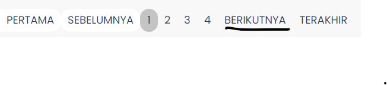
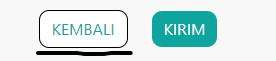

# Show Button

ShowButton adalah komponen
yang digunakan untuk menampilkan Button
Kembali atau Berikutnya.

  

### Struktur Komponen

`ShowButton` memiliki struktur komponen sebagai berikut:

| Library / Modul | Komponen yang digunakan | Properti/Atribut               | Penjelasan                                                                                                                                            |
| --------------- | ----------------------- | ------------------------------ | ----------------------------------------------------------------------------------------------------------------------------------------------------- |
| `next/link`     | `<Link>`                |                                | `<Link>` Merupakan library bawaan dari next js   digunakan untuk menuju halaman yang akan dimasukkan di atribut href.                             |
|                 |                         | `<Class = wizard__showButton>` | `<Wizard_showButton>` Komponen untuk menampilkan button, komponen show button ini dipakai di DetailMonitoringSK, DetailSuratUsulan dan WizzardSecond. |
