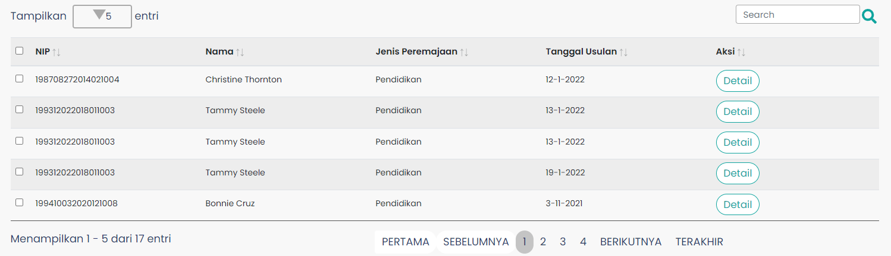

# Table Sk

Berguna untuk menampilkan data-data PNS berupa table.

| Library / Modul                    | Komponen yang digunakan                                                                                                               | Properti/Atribut | Penjelasan                                                                                                                                                                                                                                                                  |
| ---------------------------------- | ------------------------------------------------------------------------------------------------------------------------------------- | ---------------- | --------------------------------------------------------------------------------------------------------------------------------------------------------------------------------------------------------------------------------------------------------------------------- |
| `react-bootstrap`                  | `{ Form, Col, Spinner }`                                                                                                              |                  | `react-bootstrap` Merupakan library dari bootstrap khusus untuk react,   `<Form>` Sebagai pembentuk element Form dengan styling bawaan bootstrap,   `<Col>` Merupakan komponen untuk membuat kolom,   `<Spinner>` Komponen untuk tampilan loading pada website. |
| `react`                            | `React, { useState, useEffect }`                                                                                                      |                  | `react` Merupakan library react,   `useState` digunakan untuk menyimpan dan mengatur state data pada halaman,   `useEffect` digunakan untuk merender state.                                                                                                         |
| `react-redux`                      | `useSelector`                                                                                                                         |                  | `useSelector` digunakan untuk mengambil state global.                                                                                                                                                                                                                       |
| `react-bootstrap-table-next`       | `BootstrapTable`                                                                                                                      |                  | `BootstrapTable` Digunakan untuk memanggil komponen table bawaan bootstrap.                                                                                                                                                                                                 |
| `react-bootstrap-table2-toolkit`   | `ToolkitProvider, { Search }`                                                                                                         |                  | `ToolkitProvider`merender komponen toolkit dan BootstrapTable sebagai anak-anak dari ToolkitProvider, `Search` untuk menyediakan fitur pencarian pada table.                                                                                                                |
| `react-bootstrap-table2-paginator` | `paginationFactory,` `{ PaginationProvider, PaginationListStandalone, PaginationTotalStandalone, SizePerPageDropdownStandalone }` |                  | Library ini berfungsi sebagai pembuat pagination pada table.                                                                                                                                                                                                                |
| `sweetalert2`                      | `Swal`                                                                                                                                |                  | `Swal` Library untuk menampilkan popup box.                                                                                                                                                                                                                                 |
| `react-icons/fa`                   | `FaSearch`                                                                                                                            |                  | `FaSearch` Berfungi untuk menampilkan icon search bawaan react.                                                                                                                                                                                                             |
