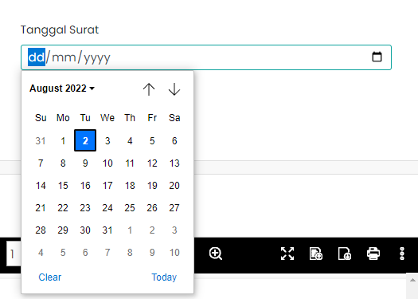

# Date Picker

Date Picker adalah komponen
yang digunakan untuk menampilkan tanggal
pada langkah kedua di halaman Ajukan Surat Keputusan.

### Struktur Komponen

`DatePicker` memiliki struktur komponen sebagai berikut:

| Library / Modul    | Komponen yang digunakan | Properti/Atribut              | Penjelasan                                                                                                                                               |
| ------------------ | ----------------------- | ----------------------------- | -------------------------------------------------------------------------------------------------------------------------------------------------------- |
| `react`            | `useState`              |                               | `react` Merupakan library react,   `useState` digunakan untuk menyimpan dan mengatur state data pada halaman.                                        |
| `react-datepicker` | `DatePicker`            |                               | `react-datepicker` Library untuk memanggil komponen DatePicker.   `DatePicker` Komponen yang digunakan user untuk menginput Tanggal.                 |
| `IconCalendarSU2`  | `IconCalendarSU2`       |                               | `IconCalendarSU2` Merupakan Library untuk memanggil komponen IconCalenderSU2.   `IconCalendarSU2` Komponen Untuk memunculkan icon kalender pada web. |
|                    |                         | `className="input-group"`     | `className="input-group` akan memberikan styple pada komponen DatePicker.                                                                                |
|                    |                         | `placeholderText`             | `placeholderText` Untuk memberikan text place holder pada DatePicker.                                                                                    |
|                    |                         | `selected`                    | `selected` Komponen ini bisa dipilih.                                                                                                                    |
|                    |                         | `onChange`                    | `onChange` suatu Atribut jika ada perubahan state maka komponen akan melakukan suatu tindakan.                                                           |
|                    |                         | `dateFormat`                  | `dateFormat` Suatu atribut untuk memnentukan format tanggalnya seperti dd/MM/YYYY.                                                                       |
|                    |                         | `showYearDropdown`            | `showYearDropdown` akan memunculkan menu dropdown untuk menampilan tanggal-tanggal.                                                                      |
|                    |                         | `scrollableMonthYearDropdown` | `scrollableMonthYearDropdown` Suatu atribut yang membuat showYearDropdown dapat di scroll.                                                               |
