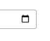

# Icon Calender

IconCalenderSU2 adalah custom component yang digunakan untuk
menampilan icon kalender yang berbentuk SVG.

### Cara Pemanggilan Komponen

| Nama Komponen     | Contoh Pemanggilan   Komponen | Penjelasan                                                                    |
| ----------------- | --------------------------------- | ----------------------------------------------------------------------------- |
| `IconCalenderSU2` | `<IconCalenderSU2 />`             | `IconCalenderSU2` ini digunakan untuk menampilkan icon kalender pada website. |
