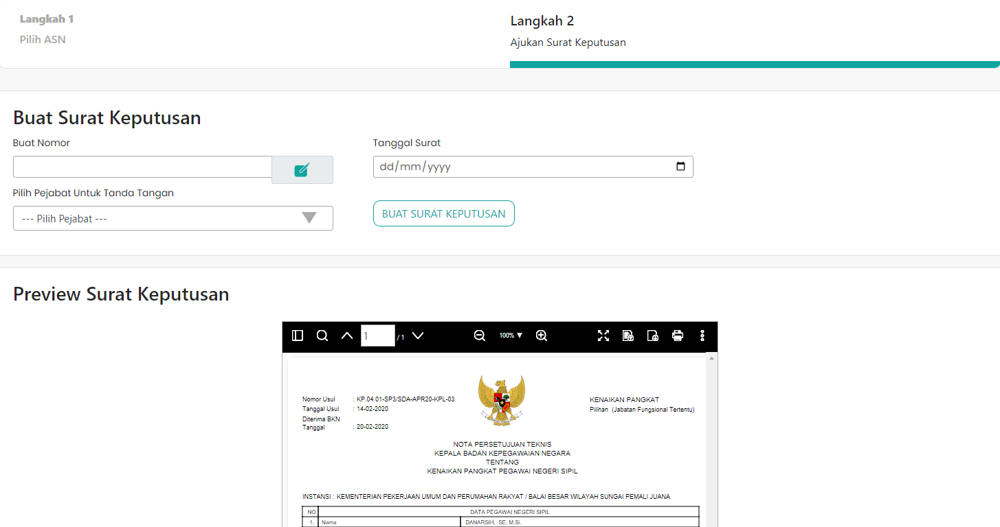

# Ajukan Surat Keputusan

Step2 merupakan suatu komponen yang ada pada website
pada bagian halaman kedua yaitu halaman Ajukan Surat Keputusan.

### Struktur Komponen

`Step2` memiliki struktur Komponen sebagai berikut:

| Library / Modul    | Komponen yang digunakan    | Penjelasan                                                                                                                                                                                                                                                                                                                                                |
| ------------------ | -------------------------- | --------------------------------------------------------------------------------------------------------------------------------------------------------------------------------------------------------------------------------------------------------------------------------------------------------------------------------------------------------- |
| `Layout`           | `Layout`                   | `<Layout>` Digunakan untuk memeriksa apakah ada user yang login atau tidak, kalau tidak ada user yang login akan mengembalikan kehalaman home.                                                                                                                                                                                                            |
| `react-bootstrap`  | `Form, Col, Button, Modal` | `react-bootstrap` Merupakan library dari bootstrap khusus untuk react,   `<Form>` Sebagai pembentuk element Form dengan styling bawaan bootstrap,   `<Col>` Merupakan komponen untuk membuat kolom,   `<Button>` Merupakan komponen untuk membuat Button dengan styling,   `<Modal>` Merupakan komponen untuk membuat tampilan Snack Bar. |
| `react`            | `useState, useEffect`      | `useState` digunakan untuk menyimpan dan mengatur state data pada halaman,   `useEffect` digunakan untuk merender state.                                                                                                                                                                                                                              |
| `BreadCrumb`       | `Breadcrumb`               | `Breadcrumb` Breadcrumb ini digunakan untuk menampilkan hirarki navigasi pada website.                                                                                                                                                                                                                                                                    |
| `next/link`        | `Link`                     | `<Link>` Merupakan library bawaan dari next js   digunakan untuk menuju halaman yang akan dimasukkan di atribut href.                                                                                                                                                                                                                                 |
| `PreviewDokPertek` | `PreviewDokPertek`         | `PreviewDokPertek` ini digunakan untuk menampilkan suatu preview pada halaman Ajukan Surat Keputusan.                                                                                                                                                                                                                                                     |
| `react-icons/io`   | `IoIosCreate`              | `IoIosCreate` Digunakan untuk menampilkan button Buat Surat Keputusan.                                                                                                                                                                                                                                                                                    |
| `react-redux`      | `useDispatch, useSelector` | `useDispatch` digunakan untuk membuat state menjadi global, dan   `useSelector` digunakan untuk mengambil state global.                                                                                                                                                                                                                               |

| Nama Komponen  | Contoh Pemanggilan   Komponen | Penjelasan                                                                              |
| -------------- | --------------------------------- | --------------------------------------------------------------------------------------- |
| `SuratUsulan2` | `<SuratUsulan2 />`                | `SuratUsulan2` ini digunakan untuk menampilkan halaman kedua pada menu surat keputusan. |
