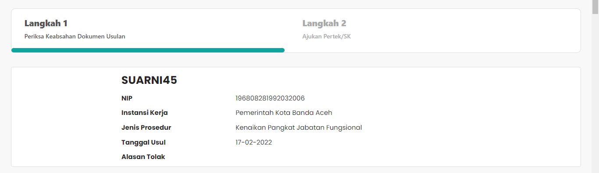
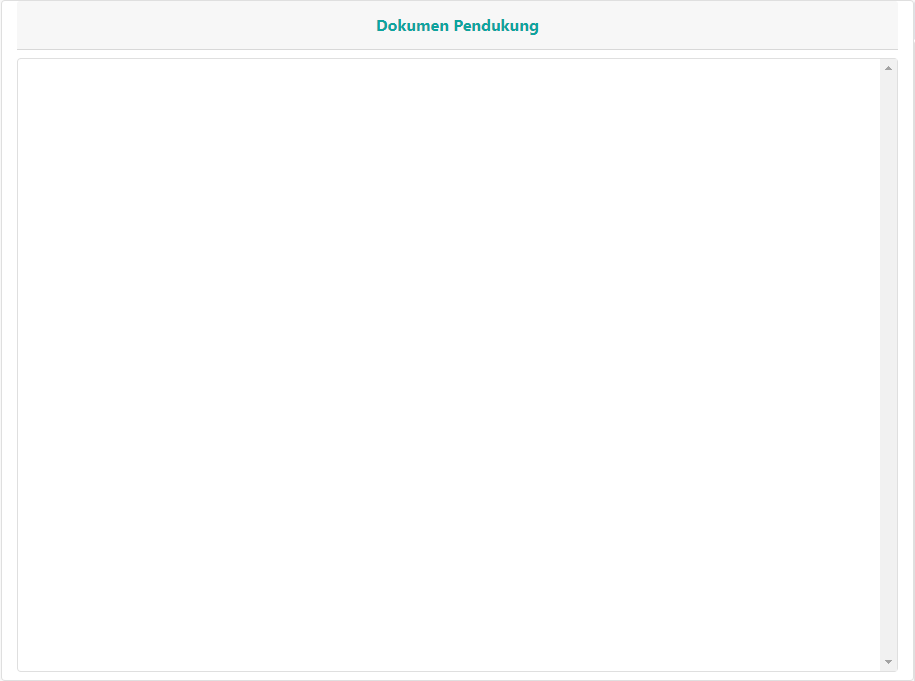
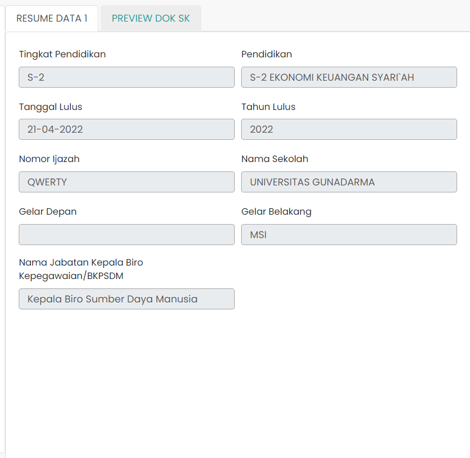
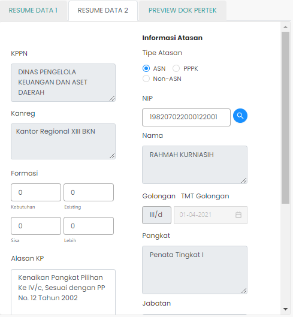
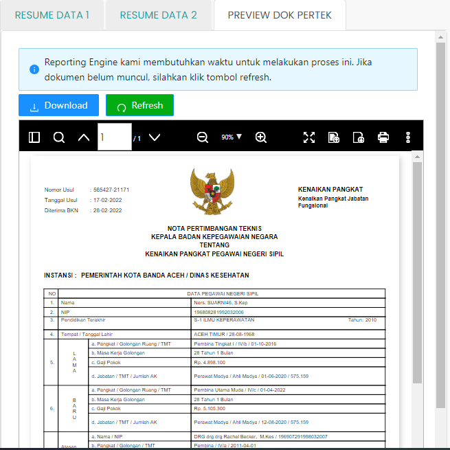

# Step-1 Validasi Usulan Kenaikan Pangkat

Setelah melakukan pencarian dan memilih usulan yang akan divalidasi, langkah selanjutnya adalah
memeriksa keabsahan dokumen usulan.

### Tampilan dan penjelasan Umum

Halaman ini menjelaskan tentang proses pemeriksaan keabsahan dokumen
usulan, informasi ASN yang bersangkutan, jabatan/posisi serta
lembaga tempat ASN yang bersangkutan bekerja.

### Card Informasi ASN

Card Informasi ASN berisi informasi singkat ASN yang mengajukan
usulan kenaikan pangkat. Informasi yang ditampilkan seperti
Nama ASN, NIP, Instansi Kerja, Jenis Prosedur, Tanggal Usul,
Alasan Tolak.

Struktur dari komponen Card Informasi ASN adalah:

| Nama Komponen | Contoh Pemanggilan   Komponen                                                                                              | Properti/Atribut | Tipe Data   Atribut | Penjelasan                                                                                                    |
| ------------- | ------------------------------------------------------------------------------------------------------------------------------ | ---------------- | ----------------------- | ------------------------------------------------------------------------------------------------------------- |
| CardProfile   | `<CardProfile`   &nbsp;&nbsp;&nbsp;&nbsp;&nbsp;`dataUsulan=`   &nbsp;&nbsp;&nbsp;&nbsp;&nbsp;`{dataUsulan}`   `/>` | `dataUsulan`     | `Object`                | Properti data usulan berisi informasi   data diri ASN, jenis layanan,   hingga dokumen-dokumen usulan |

Berikut adalah tampilan dari informasi ASN yang mengajukan usulan
kenaikan pangkat.

### Dokumen Pendukung

Dokumen Pendukung adalah komponen atau bagian dari
langkah pertama dalam proses validasi usulan kenaikan pangkat.
Bagian Dokumen Pendukung berisi informasi mengenai
dokumen-dokumen milik ASN yang digunakan sebagai
pendukung keputusan dan validasi usulan kenaikan pangkat
yang diajukan.

Struktur dari komponen Dokumen Pendukung adalah:

| Nama Komponen | Contoh Pemanggilan   Komponen                                                                                                                                                                                                          | Properti/Atribut   | Tipe Data   Atribut | Penjelasan                                                                                                                                                                                               |
| ------------- | ------------------------------------------------------------------------------------------------------------------------------------------------------------------------------------------------------------------------------------------ | ------------------ | ----------------------- | -------------------------------------------------------------------------------------------------------------------------------------------------------------------------------------------------------- |
| CardProfile   | `<DokPendukung`   &nbsp;&nbsp;&nbsp;&nbsp;&nbsp;`dataIsHere=`   &nbsp;&nbsp;&nbsp;&nbsp;&nbsp;`{dataIsHere}`   &nbsp;&nbsp;&nbsp;&nbsp;&nbsp;`dokumenTerupload=`   &nbsp;&nbsp;&nbsp;&nbsp;&nbsp;`{finalArray}`   `/>` | `dataIsHere`       | `Boolean`               | dataIsHere bertipe   boolean yang berguna   untuk memeriksa apakah ASN   yang mengajukan usulan   memiliki dokumen pendukung.                                                            |
|               |                                                                                                                                                                                                                                            | `dokumenTerupload` | `Array of object`       | dokumenTerupload   bertipe array of object   yang berisi data   dokumen-dokumen  pendukung yang   dilampirkan oleh ASN   yang melakukan pengajuan   usulan kenaikan pangkat. |

Berikut adalah tampilan dari informasi dokumen pendukung.

Disamping dokumen pendukung, terdapat data resume ASN.
Disini terdapat Resume Data 1, Resume Data 2, serta Preview
Dokumen Persetujuan Teknis (Pertek).

Resume Data 1 berisi informasi tentang golongan ASN,
pendidikan terakhir ASN,
jabatan, masa kerja, serta lembaga tempat ASN
bekerja.

Berikut adalah tampilan dari Resume Data 1

Resume Data 2 berisi informasi tentang
Kantor Pelayanan Perbendaharaan Negara (KPPN),
atasan pada lembaga tempat ASN yang bersangkutan bekerja, serta
alasan kenaikan pangkat.

Berikut adalah tampilan dari Resume Data 2

Bagian Preview Dokumen Persetujuan Teknis berisi dokumen
Pertek yang dibuat otomatis oleh Reporting Engine yang
nantinya dapat diunduh oleh ASN yang bersangkutan untuk diajukan.

Berikut adalah tampilan dari Preview Dokumen Persetujuan Teknis

Lalu pada bagian bawah terdapat tiga tombol.

- Tombol `Sebelumnya` akan mengarah kembali ke halaman
  Validasi Usulan.

- Tombol `Tolak Usulan` akan mengarah ke halaman penolakan
  usulan.

- Tombol `Setujui` akan mengarah ke langkah ke-2 dari proses
  pengajuan usulan kenaikan pangkat.
