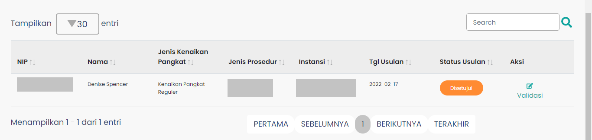

# Validasi Usulan Kenaikan Pangkat

### Tampilan dan Penjelasan Umum

Halaman Validasi Usulan Kenaikan Pangkat adalah halaman yang menampilkan data usulan untuk kenaikan pangkat ASN.Pada halaman ini terdapat formulir untuk mencari usulan berdasarkan NIP PNS, Nama PNS, Tanggal Usulan, dan sebagainya.

Berikut adalah tampila dari form pencarian usulan.

Pada halaman ini juga terdapat tabel yang akan menampilkan data hasil form pencarian. Tabel tersebut berisi data PNS meliputi NIP, Nama, Jenis Kenaikan Pangkat, Jenis Prosedur, Instansi, hingga Status Usulan.

Berikut adalah tampilan dari tabel data usulan.

### Struktur dan Komponen yang Digunakan

Halaman ini menggunakan `React-Bootstrap` sebagai framework tampilan. Dan ada beberapa cutstom-component yang digunakan seperti `Breadcrumb` yang digunakan untuk menunjukkan hirarki navigasi, `TableVU` yang digunakan untuk menampilkan data usulan dalam bentuk tabel, serta `Layout` yang merupakan tata letak dasar halaman.

Komponen `ValidasiUsulan` juga menggunakan beberapa Hooks dari `React` diantaranya, `useState` dan `useEffect`.

### Library atau Modul yang Digunakan

| Library / Modul | Function / Komponen        |
| --------------- | -------------------------- |
| React-Bootstrap | Form, Col, Button          |
| React           | React, useState, useEffect |
| React-Redux     | useDispatch, useSelector   |
| notification    | Ant Design                 |

### Custom Component yang Digunakan

| Nama Komponen | Contoh Pemanggilan Komponen                                                       | Fungsi Komponen                                                                                      |
| ------------- | --------------------------------------------------------------------------------- | ---------------------------------------------------------------------------------------------------- |
| Layout        | `<Layout> <Layout />`                                                             | Layout utama dari setiap halaman pada aplikasi Layanan Kenaikan Pangkat SIASN-BKN                    |
| Breadcrumb    | `<Breadcrumb />`                                                                  | Digunakan untuk menunjukkan hirarki navigasi pada halaman                                            |
| TableVU       | `<TableVU dataTable={isSearch ? dataTable : data} isLoading={loading}></TableVU>` | Merupakan komponen tabel yang menampilkan data usulan kenaikan pangkat, dan juga detail data lainnya |
