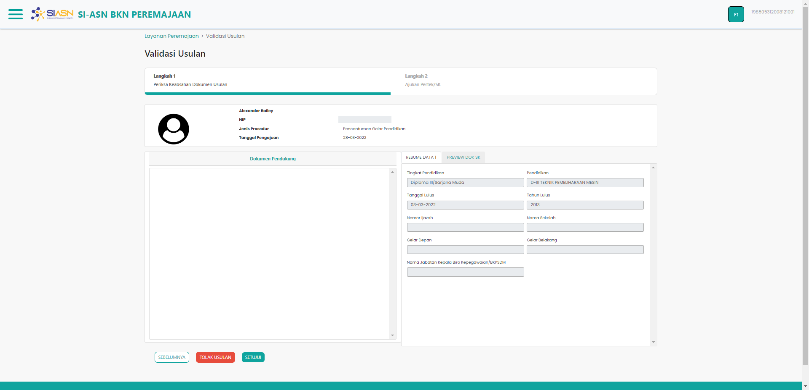

# Detail Monitoring Usulan

Detail Monitoring Usulan merupakan komponen halaman yang digunakan untuk
melihat detail lengkap dari usulan yang di ajukan sebelumnya.

### Struktur Komponen

`DetailMonitoringUsulan` memiliki struktur komponen sebagai berikut:

| Nama Komponen          | Contoh Pemanggilan   Komponen                                                                                   | Properti/Atribut | Tipe Data   Atribut | Penjelasan                                                                                                                                                                                              |
| ---------------------- | ------------------------------------------------------------------------------------------------------------------- | ---------------- | ----------------------- | ------------------------------------------------------------------------------------------------------------------------------------------------------------------------------------------------------- |
| DetailMonitoringUsulan | `<DetailMonitoringUsulan` &nbsp;&nbsp;`idUsul={id}` &nbsp;&nbsp;`dataUsulan={dataRes}` &nbsp;&nbsp;`/>` | `idUsul`         | `String`                | Properti id usul berisi informasi   id usulan yang diajukan yang akan digunakan   sebagai acuan untuk mengambil   data Dokumen Persetujuan Teknis   berdasarkan id usulan yang diajukan |
|                        |                                                                                                                     | `dataUsulan`     | `Object`                | Properti data usulan berisi informasi   data diri ASN, jenis layanan,   hingga dokumen-dokumen usulan                                                                                           |
