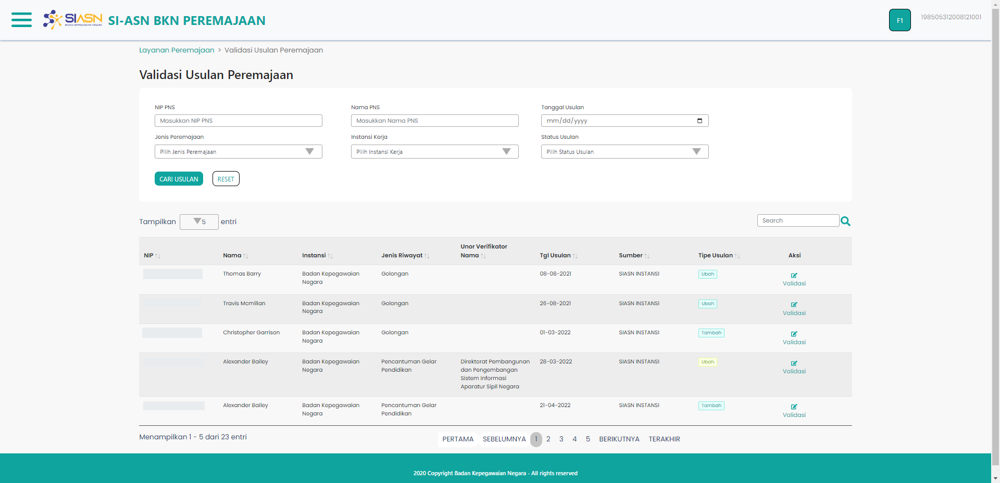

# Monitoring Usulan

Monitoring Usulan merupakan komponen halaman yang berisi
semua data yang diajukan sebelumnya yang dikemas dalam sebuah
tabel serta fitur pencarian usulan bedasarkan beberapa data usulan.

### Struktur Komponen

`MonitoringUsulan` memiliki struktur komponen sebagai berikut:

| Nama Komponen    | Contoh Pemanggilan   Komponen | Properti/Atribut | Tipe Data   Atribut | Penjelasan                                                                                                       |
| ---------------- | --------------------------------- | ---------------- | ----------------------- | ---------------------------------------------------------------------------------------------------------------- |
| MonitoringUsulan | `<MonitoringUsulan />`            | -                | -                       | Pada MonitoringUsulan berisi informasi   semua usulan yang sudah diajukan   serta fitur pencarian usulan |
