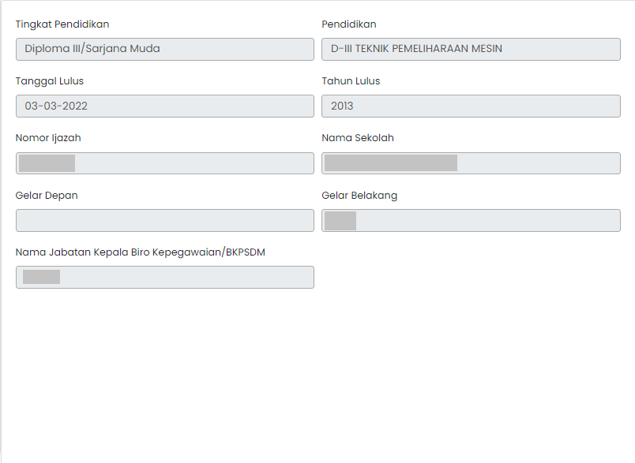

# Pencantum Gelar

Pencantum merupakan komponen yang Gelar berisi informasi tentang tingkat pendidikan ASN,
pendidikan terakhir ASN,
tanggal lulus, tahun lulus, nomor ijazah, nama sekolah, gelar depan, gelar belakang, dan
Nama jabatan kepala biro kepegawaian/BKPSDM.

### Struktur Komponen

`PencantumanGelar` memiliki struktur komponen sebagai berikut:

| Nama Komponen    | Contoh Pemanggilan   Komponen                                                                                          | Properti/Atribut | Tipe Data   Atribut | Penjelasan                                                                                                    |
| ---------------- | -------------------------------------------------------------------------------------------------------------------------- | ---------------- | ----------------------- | ------------------------------------------------------------------------------------------------------------- |
| PencantumanGelar | `<PencantumanGelar`   &nbsp;&nbsp;&nbsp;&nbsp;&nbsp;`dataUsulan=`   &nbsp;&nbsp;&nbsp;&nbsp;&nbsp;`{dataUsulan}/>` | `dataUsulan`     | `Object`                | Properti data usulan berisi informasi   data diri ASN, jenis layanan,   hingga dokumen-dokumen usulan |
