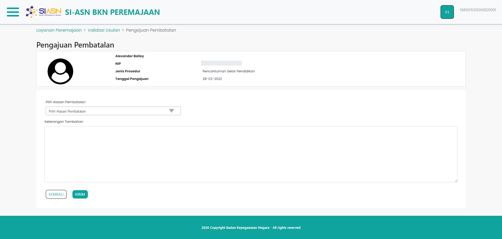

# Pengajuan Pembatalan

Pengajuan Pembatalan merupakan komponen halaman yang digunakan untuk mengajukan
pembatalan pada usulan yang sebelumnya diajukan, setelah usulan ASN di tolak.

### Struktur Komponen

`PengajuanPembatalan` memiliki struktur komponen sebagai berikut:

| Nama Komponen       | Contoh Pemanggilan   Komponen                                                                                | Properti/Atribut | Tipe Data   Atribut | Penjelasan                                                                                                                                                                                              |
| ------------------- | ---------------------------------------------------------------------------------------------------------------- | ---------------- | ----------------------- | ------------------------------------------------------------------------------------------------------------------------------------------------------------------------------------------------------- |
| PengajuanPembatalan | `<PengajuanPembatalan` &nbsp;&nbsp;`idUsul={id}` &nbsp;&nbsp;`dataUsulan={dataRes}` &nbsp;&nbsp;`/>` | `idUsul`         | `String`                | Properti id usul berisi informasi   id usulan yang diajukan yang akan digunakan   sebagai acuan untuk mengambil   data Dokumen Persetujuan Teknis   berdasarkan id usulan yang diajukan |
|                     |                                                                                                                  | `dataUsulan`     | `Object`                | Properti data usulan berisi informasi   data diri ASN, jenis layanan,   hingga dokumen-dokumen usulan                                                                                           |
