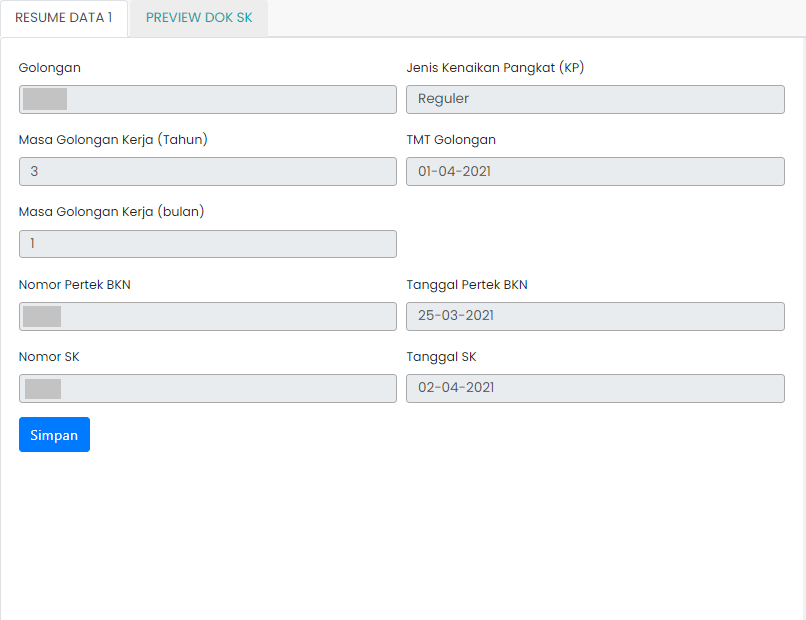

# Resume Data 1

Resume Data 1 berisi informasi tentang golongan, jenis kenaikan pangkat (KP), masa golongan kerja, tmt golongan, masa golongan kerja, nomor pertek BKN, tanggal pertek BKN, nomor SK, tanggal SK
pendidikan terakhir ASN,
jabatan, masa kerja, serta lembaga tempat ASN
bekerja.

### Struktur Komponen

`ResumeData1` memiliki struktur komponen sebagai berikut:

| Nama Komponen | Contoh Pemanggilan   Komponen                                                                                                                             | Properti/Atribut | Tipe Data   Atribut | Penjelasan                                                                                                    |
| ------------- | ------------------------------------------------------------------------------------------------------------------------------------------------------------- | ---------------- | ----------------------- | ------------------------------------------------------------------------------------------------------------- |
| ResumeData1   | `<ResumeData1`   &nbsp;&nbsp;&nbsp;&nbsp;&nbsp;`dataUsulan=`   &nbsp;&nbsp;&nbsp;&nbsp;&nbsp;`{dataUsulan}` &nbsp;&nbsp;&nbsp;&nbsp;&nbsp;   `/>` | `dataUsulan`     | `Object`                | Properti data usulan berisi informasi   data diri ASN, jenis layanan,   hingga dokumen-dokumen usulan |
