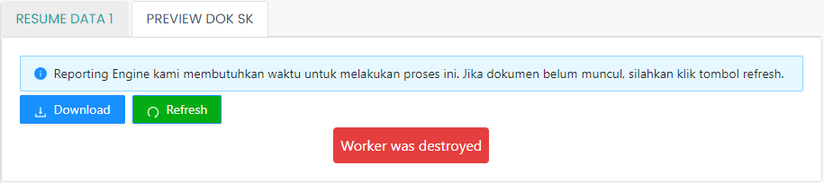

# Preview Dokumen Surat Keputusan

PreviewDokPertekSK atau Preview Dokumen Surat Keputusan merupakan komponen yang berisi dokumen
Surat Keputusan yang dibuat otomatis oleh Reporting Engine yang
nantinya dapat diunduh oleh ASN yang bersangkutan untuk diajukan.

### Struktur Komponen

`PreviewDokPertekSK` memiliki struktur komponen sebagai berikut:

| Nama Komponen      | Contoh Pemanggilan   Komponen                                                                                             | Properti/Atribut | Tipe Data   Atribut | Penjelasan                                                                                                                                                                                              |
| ------------------ | ----------------------------------------------------------------------------------------------------------------------------- | ---------------- | ----------------------- | ------------------------------------------------------------------------------------------------------------------------------------------------------------------------------------------------------- |
| PreviewDokPertekSK | `<PreviewDokPertekSK`   &nbsp;&nbsp;&nbsp;&nbsp;&nbsp;`idUsul=`   &nbsp;&nbsp;&nbsp;&nbsp;&nbsp;`{idUsul}`   `/>` | `idUsul`         | `String`                | Properti id usul berisi informasi   id usulan yang diajukan yang akan digunakan   sebagai acuan untuk mengambil   data Dokumen Persetujuan Teknis   berdasarkan id usulan yang diajukan |
