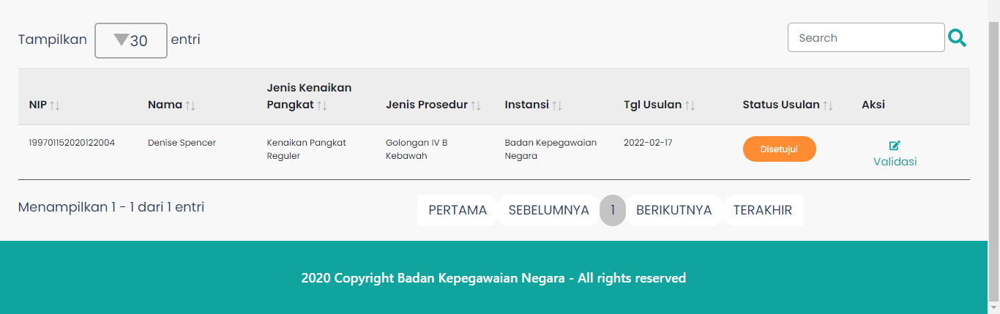

# Tabel Validasi Usulan

Tabel Validasi Usulan adalah komponen yang berada
pada halaman Validasi Usulan yang berguna untuk menampilkan
data usulan.

### Struktur Komponen

`TableVU` memiliki struktur komponen sebagai berikut:

| Nama Komponen | Contoh Pemanggilan   Komponen                                                                        | Properti/Atribut | Tipe Data   Atribut | Penjelasan                                                                                           |
| ------------- | -------------------------------------------------------------------------------------------------------- | ---------------- | ----------------------- | ---------------------------------------------------------------------------------------------------- |
| TableVU       | `<TableVU`   &nbsp;&nbsp;&nbsp;&nbsp; `dataTable={data}`   &nbsp;&nbsp;&nbsp;&nbsp; `</TableVU>` | `dataTable`      | `Object`                | Properti dataTable berisi data   validasi usulan peremajaan ASN   yang di tampilkan di table |
