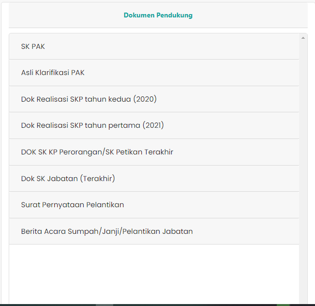

# Dokumen Pendukung

Dokumen Pendukung adalah komponen atau bagian dari
langkah pertama dalam proses validasi usulan kenaikan pangkat.
Bagian Dokumen Pendukung berisi informasi mengenai
dokumen-dokumen milik ASN yang digunakan sebagai
pendukung keputusan dan validasi usulan kenaikan pangkat
yang diajukan.

### Struktur Komponen

`DokPendukung` memiliki struktur komponen sebagai berikut:

| Nama Komponen | Contoh Pemanggilan   Komponen                                                                                                                                                                                                          | Properti/Atribut   | Tipe Data   Atribut | Penjelasan                                                                                                                                                                                               |
| ------------- | ------------------------------------------------------------------------------------------------------------------------------------------------------------------------------------------------------------------------------------------ | ------------------ | ----------------------- | -------------------------------------------------------------------------------------------------------------------------------------------------------------------------------------------------------- |
| DokPendukung  | `<DokPendukung`   &nbsp;&nbsp;&nbsp;&nbsp;&nbsp;`dataIsHere=`   &nbsp;&nbsp;&nbsp;&nbsp;&nbsp;`{dataIsHere}`   &nbsp;&nbsp;&nbsp;&nbsp;&nbsp;`dokumenTerupload=`   &nbsp;&nbsp;&nbsp;&nbsp;&nbsp;`{finalArray}`   `/>` | `dataIsHere`       | `Boolean`               | dataIsHere bertipe   boolean yang berguna   untuk memeriksa apakah ASN   yang mengajukan usulan   memiliki dokumen pendukung.                                                            |
|               |                                                                                                                                                                                                                                            | `dokumenTerupload` | `Array of object`       | dokumenTerupload   bertipe array of object   yang berisi data   dokumen-dokumen  pendukung yang   dilampirkan oleh ASN   yang melakukan pengajuan   usulan kenaikan pangkat. |
