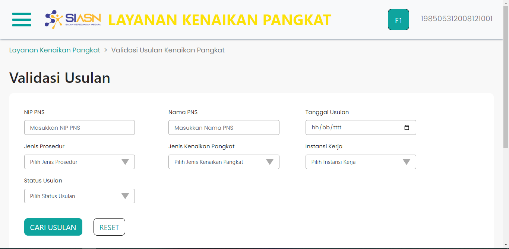

# Form Cari Usulan

Form cari usulan adalah bagian dari halaman Validasi Usulan
Kenaikan Pangkat. Form cari usulan berguna untuk mencari
data usulan berdasarkan NIP, nama ASN, tanggal usulan,
jenis prosedur, jenis kenaikan pangkat, instansi kerja,
dan status usulan.

Form cari usulan bukan merupakan komponen, dan dibuat dengan
menggunakan library `react-bootstrap`.

### Struktur Komponen

Berikut adalah beberapa komponen dari library `react-bootstrap` yang
digunakan dalam membuat Form Cari Usulan.

| Library / Modul   | Komponen yang digunakan | Penjelasan                                                                                                                                   |
| ----------------- | ----------------------- | -------------------------------------------------------------------------------------------------------------------------------------------- |
| `react-bootstrap` | `Form`                  | `Form` digunakan untuk membuat form yang dapat digunakan untuk menampung input dari user.                                                    |
|                   | `Form.Label`            | `Form.Label` digunakan untuk membuat label pada suatu field input.                                                                           |
|                   | `Form.Control`          | `Form.Control` digunakan untuk membuat sebuah field input. `Form.Control` memiliki beberapa `type`, diantaranya `text`, `date`, dan `email`. |
|                   | `Form.Group`            | `Form.Group` digunakan untuk mengelompokkan beberapa komponen pada form.                                                                     |
|                   | `Row`                   | `Row` digunakan untuk membuat tampilan menjadi baris. Pada umumnya `Row` digunakan dengan `Col`.                                             |
|                   | `Col`                   | `Col` digunakan untuk mengatur konten di dalam `Row`.                                                                                        |
|                   | `Button`                | `Button` adalah komponen tombol pada `react-bootstrap`                                                                                       |
