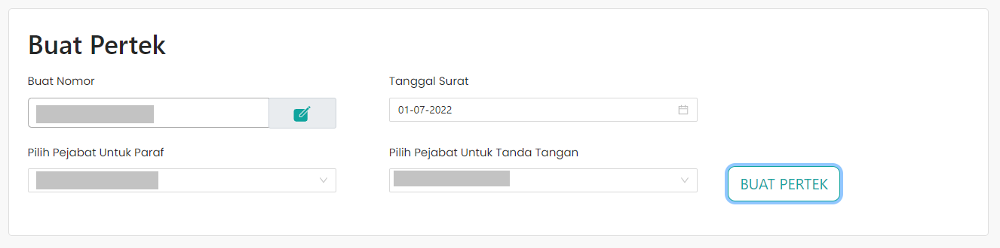

# Form Pembuatan Dokumen Persetujuan Teknis

Form Pembuatan Pertek memungkinkan user yang mengajukan usulan
membuat dokumen persetujuan kerja. User harus
mengisi semua form yang tersedia. Mulai dari membuat nomor
Dokumen Pertek, memilih tanggal surat, serta memilih
pejabat yang akan memberikan paraf serta tanda tangan
pada Dokumen Pertek tersebut yang kemudian akan diajukan.

<mark>Pengguna tidak dapat membuat Dokumen Pertek sebelum mengisi semua form dengan lengkap.</mark>
 
 

### Struktur Komponen

Berikut adalah beberapa komponen dari library `react-bootstrap` yang
digunakan dalam membuat Form Pembuatan Dokumen Persetujuan Teknis.

| Library / Modul   | Komponen yang digunakan | Penjelasan                                                                                                                                   |
| ----------------- | ----------------------- | -------------------------------------------------------------------------------------------------------------------------------------------- |
| `react-bootstrap` | `Form`                  | `Form` digunakan untuk membuat form yang dapat digunakan untuk menampung input dari user.                                                    |
|                   | `Form.Label`            | `Form.Label` digunakan untuk membuat label pada suatu field input.                                                                           |
|                   | `Form.Control`          | `Form.Control` digunakan untuk membuat sebuah field input. `Form.Control` memiliki beberapa `type`, diantaranya `text`, `date`, dan `email`. |
|                   | `Form.Group`            | `Form.Group` digunakan untuk mengelompokkan beberapa komponen pada form.                                                                     |
|                   | `Row`                   | `Row` digunakan untuk membuat tampilan menjadi baris. Pada umumnya `Row` digunakan dengan `Col`.                                             |
|                   | `Col`                   | `Col` digunakan untuk mengatur konten di dalam `Row`.                                                                                        |
|                   | `Button`                | `Button` adalah komponen tombol pada `react-bootstrap`                                                                                       |
