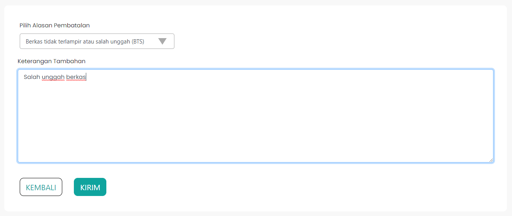
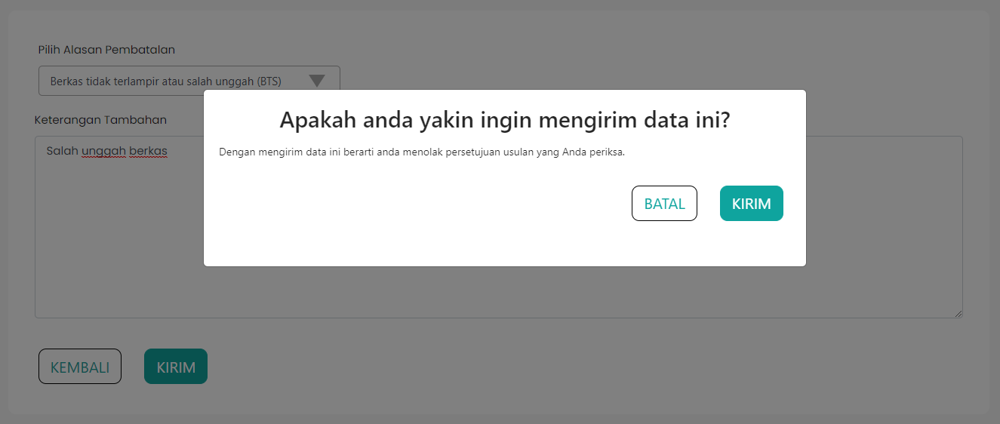

# Form Tolak Usulan

Pada proses validasi usulan kenaikan pangkat, terdapat
opsi untuk menolak usulan kenaikan pangkat tersebut.
Tentunya proses penolakan ini bukan tanpa alasan, sehingga
ketika sebuah usulan kenaikan pangkat ditolak, maka terdapat alasan
terkait penolakan tersebut. Alasan diantaranya seperti dokumen yang
kurang lengkap, terdapat kesalahan saat menyantumkan dokumen
pendukung, dan sebagainya.

Form tolak usulan atau pengajuan pembatalan usulan ini
menjelaskan proses pembatalan usulan kenaikan pangkat. Pada halaman
ini terdapat informasi dari ASN yang mengajukan usulan kenaikan pangkat,
serta terdapat pilihan alasan pembatalan dan keterangan tambahan
alasan pembatalan.

Alasan pembatalan yang tersedia diantaranya:

- Berkas tidak terlampir atau salah unggah
- Melampaui pangkat atasan langsung
- SKP bernilai cukup
- Angka kredit tidak mencukupi
- dan sebagainya

### Tampilan Form Tolak Usulan

### Tampilan Modal Form Tolak Usulan

### Struktur Komponen

Berikut adalah beberapa komponen
dari library `react-bootstrap` yang
digunakan dalam membuat Form Tolak Usulan.

| Library / Modul   | Komponen yang digunakan | Penjelasan                                                                                                                                              |
| ----------------- | ----------------------- | ------------------------------------------------------------------------------------------------------------------------------------------------------- |
| `react-bootstrap` | `Form`                  | `Form` digunakan untuk membuat form yang dapat digunakan untuk menampung input dari user.                                                               |
|                   | `Form.Label`            | `Form.Label` digunakan untuk membuat label pada suatu field input.                                                                                      |
|                   | `Form.Control`          | `Form.Control` digunakan untuk membuat sebuah field input. `Form.Control` memiliki beberapa `type`, diantaranya `text`, `date`, dan `email`.            |
|                   | `Form.Group`            | `Form.Group` digunakan untuk mengelompokkan beberapa komponen pada form.                                                                                |
|                   | `Row`                   | `Row` digunakan untuk membuat tampilan menjadi baris. Pada umumnya `Row` digunakan dengan `Col`.                                                        |
|                   | `Col`                   | `Col` digunakan untuk mengatur konten di dalam `Row`.                                                                                                   |
|                   | `Modal`                 | `Modal` adalah komponen yang telah dibuat oleh `react-bootstrap` berupa sebuah pop-up content yang didalamnya dapat kita gunakan untuk membuat tampilan |
|                   | `Button`                | `Button` adalah komponen tombol pada `react-bootstrap`                                                                                                  |
