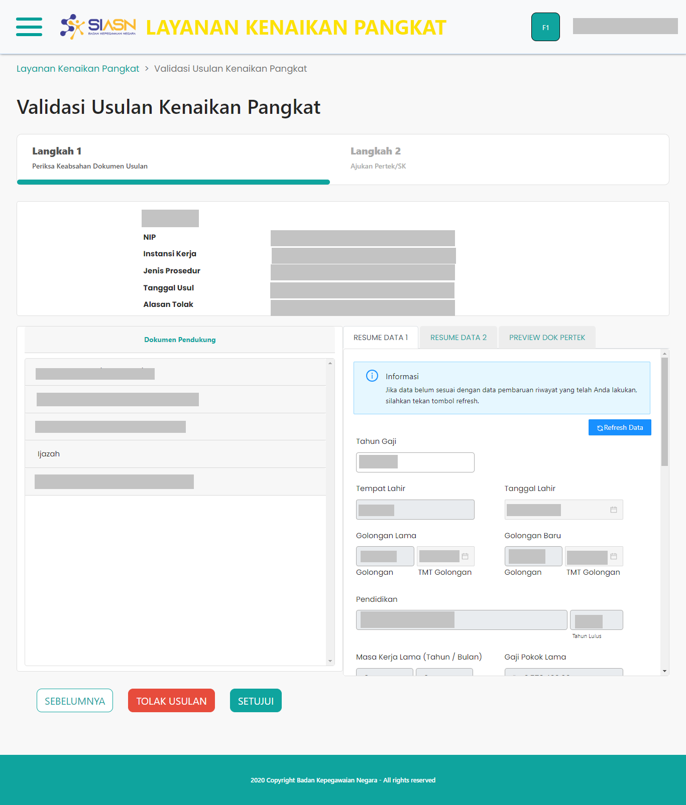

# Halaman Step-1

`DetailMonitoringUsulan` merupakan _custom component_ yang digunakan untuk
menampilkan halaman Step-1 pada menu Validasi Usulan Kenaikan Pangkat.
Halaman Step-1 digunakan untuk memeriksa kelengkapan serta
keabsahan dokumen usulan yang diajukan oleh ASN.

Halaman Step-1 sendiri terdiri dari beberapa _section_ utama, yaitu:

- [Card Info ASN](/validasi-usulan-kenaikan-pangkat/card-info-asn "Card Info ASN")
- [Dokumen Pendukung](/validasi-usulan-kenaikan-pangkat/dokumen-pendukung "Dokumen Pendukung")
- [Resume Data 1](/validasi-usulan-kenaikan-pangkat/resume-data-1 "Resume Data 1")
- [Resume Data 2](/validasi-usulan-kenaikan-pangkat/resume-data-2 "Resume Data 2")
- [Preview Dok Pertek](/validasi-usulan-kenaikan-pangkat/preview-dok-pertek "Preview Dok Pertek")

Komponen `DetailMonitoringUsulan` adalah komponen induk, sehingga
didalamnya terdapat beberapa komponen yang digunakan, diantaranya:

- [Layout](/validasi-usulan-kenaikan-pangkat/layout "Layout")
- [Breadcrumb](/validasi-usulan-kenaikan-pangkat/breadcrumb "Breadcrumb")
- [Card Info ASN](/validasi-usulan-kenaikan-pangkat/card-info-asn "Card Info ASN")
- [Dokumen Pendukung](/validasi-usulan-kenaikan-pangkat/dokumen-pendukung "Dokumen Pendukung")
- [Resume Data 1](/validasi-usulan-kenaikan-pangkat/resume-data-1 "Resume Data 1")
- [Resume Data 2](/validasi-usulan-kenaikan-pangkat/resume-data-2 "Resume Data 2")
- [Preview Dok Pertek](/validasi-usulan-kenaikan-pangkat/preview-dok-pertek "Preview Dok Pertek")

Berikut adalah tampilan dari halaman Step-1:

### Struktur Komponen

`DetailMonitoringUsulan` memiliki struktur komponen sebagai berikut:

| Nama Komponen          | Contoh Pemanggilan   Komponen                                                                                                                                                                                               | Properti/Atribut | Tipe Data   Atribut | Penjelasan                                                                                                     |
| ---------------------- | ------------------------------------------------------------------------------------------------------------------------------------------------------------------------------------------------------------------------------- | ---------------- | ----------------------- | -------------------------------------------------------------------------------------------------------------- |
| DetailMonitoringUsulan | `<DetailMonitoringUsulan`   &nbsp;&nbsp;&nbsp;&nbsp;&nbsp;`dataUsulan=`   &nbsp;&nbsp;&nbsp;&nbsp;&nbsp;`{dataRes}`   &nbsp;&nbsp;&nbsp;&nbsp;&nbsp;`idUsul=`   &nbsp;&nbsp;&nbsp;&nbsp;&nbsp;`{id}`   `/>` | `dataUsulan`     | `Object`                | Properti `dataUsulan` berisi informasi   data diri ASN, jenis layanan,   hingga dokumen-dokumen usulan |
|                        |                                                                                                                                                                                                                                 | `idUsul`         | `String`                | Properti `idUsul` berisi   nilai id dari usulan yang dikirim.                                              |
