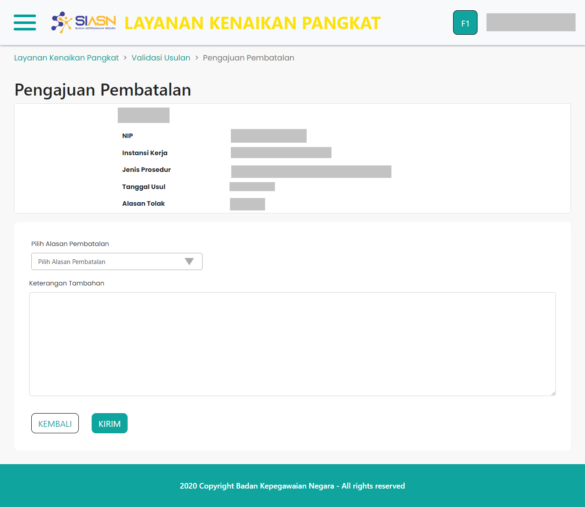

# Halaman Tolak Usulan

`PengajuanPembatalan` merupakan _custom component_ yang digunakan untuk
menampilkan halaman Tolak Usulan pada menu Validasi Usulan Kenaikan Pangkat.
Pada halaman Tolak Usulan terdapat Form Tolak Usulan yang digunakan
apabila suatu usulan ditolak. Form Tolak Usulan diisi dengan menyertakan
alasan pembatalan, serta keterangan tambahan mengenai
penolakan usulan kenaikan pangkat.

Halaman Tolak Usulan sendiri terdiri dari beberapa _section_ utama, yaitu:

- [Card Info ASN](/validasi-usulan-kenaikan-pangkat/card-info-asn "Card Info ASN")
- [Form Pembuatan Dok Pertek](/validasi-usulan-kenaikan-pangkat/form-pembuatan-pertek "Form Pembuatan Dok Pertek")
- [Preview Dok Pertek](/validasi-usulan-kenaikan-pangkat/preview-dok-pertek "Preview Dok Pertek")

Komponen `BuatPertekSK` adalah komponen induk, sehingga
didalamnya terdapat beberapa komponen yang digunakan, diantaranya:

- [Layout](/validasi-usulan-kenaikan-pangkat/layout "Layout")
- [Breadcrumb](/validasi-usulan-kenaikan-pangkat/breadcrumb "Breadcrumb")
- [Card Info ASN](/validasi-usulan-kenaikan-pangkat/card-info-asn "Card Info ASN")
- [Preview Dok Pertek](/validasi-usulan-kenaikan-pangkat/preview-dok-pertek "Preview Dok Pertek")

Berikut adalah tampilan dari halaman Tolak Usulan:

### Struktur Komponen

`PengajuanPembatalan` memiliki struktur komponen sebagai berikut:

| Nama Komponen       | Contoh Pemanggilan   Komponen                                                                                                                                                                                            | Properti/Atribut | Tipe Data   Atribut | Penjelasan                                                                                                     |
| ------------------- | ---------------------------------------------------------------------------------------------------------------------------------------------------------------------------------------------------------------------------- | ---------------- | ----------------------- | -------------------------------------------------------------------------------------------------------------- |
| PengajuanPembatalan | `<PengajuanPembatalan`   &nbsp;&nbsp;&nbsp;&nbsp;&nbsp;`dataUsulan=`   &nbsp;&nbsp;&nbsp;&nbsp;&nbsp;`{dataRes}`   &nbsp;&nbsp;&nbsp;&nbsp;&nbsp;`idUsul=`   &nbsp;&nbsp;&nbsp;&nbsp;&nbsp;`{id}`   `/>` | `dataUsulan`     | `Object`                | Properti `dataUsulan` berisi informasi   data diri ASN, jenis layanan,   hingga dokumen-dokumen usulan |
|                     |                                                                                                                                                                                                                              | `idUsul`         | `String`                | Properti `idUsul` berisi   nilai id dari usulan yang dikirim.                                              |
