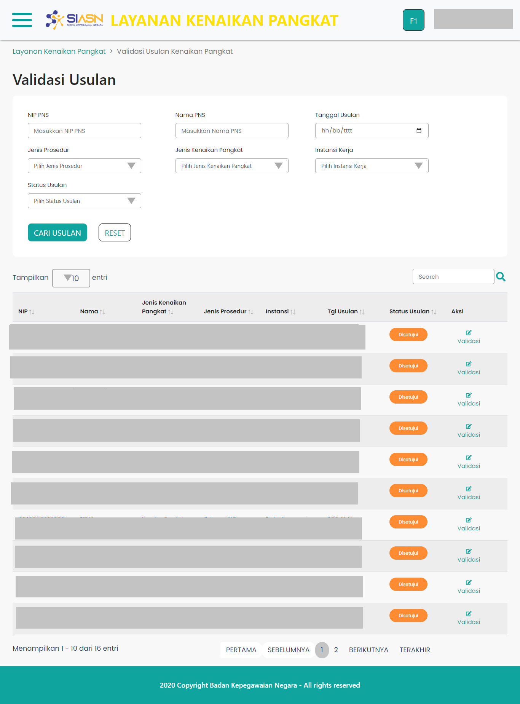

# Halaman Validasi Usulan

`ValidasiUsulan` merupakan _custom component_ yang digunakan untuk
menampilkan halaman utama pada menu Validasi Usulan Kenaikan Pangkat.
Pada halaman Validasi Usulan terdapat Form Cari Usulan yang berguna
untuk mencari data usulan sesuai dengan kata kunci
yang diinput pada Form Cari Usulan. Selain itu, terdapat
Tabel Validasi Usulan yang berguna untuk menampilkan data usulan.

Halaman Validasi Usulan sendiri terdiri dari beberapa _section_ utama, yaitu:

- [Form Cari Usulan](/validasi-usulan-kenaikan-pangkat/form-cari-usulan "Form Cari Usulan")
- [Tabel Validasi Usulan](/validasi-usulan-kenaikan-pangkat/tabel-validasi-usulan "Tabel Validasi Usulan")

Komponen `ValidasiUsulan` adalah komponen induk, sehingga
didalamnya terdapat beberapa komponen yang digunakan, diantaranya:

- [Layout](/validasi-usulan-kenaikan-pangkat/layout "Layout")
- [Tabel Validasi Usulan](/validasi-usulan-kenaikan-pangkat/tabel-validasi-usulan "Tabel Validasi Usulan")
- [Breadcrumb](/validasi-usulan-kenaikan-pangkat/breadcrumb "Breadcrumb")

Berikut adalah tampilan dari halaman Validasi Usulan:

### Struktur Komponen

`ValidasiUsulan` memiliki struktur komponen sebagai berikut:

| Nama Komponen  | Contoh Pemanggilan   Komponen | Properti/Atribut | Tipe Data   Atribut | Penjelasan                                                                                                                                           |
| -------------- | --------------------------------- | ---------------- | ----------------------- | ---------------------------------------------------------------------------------------------------------------------------------------------------- |
| ValidasiUsulan | `<ValidasiUsulan />`              | -                | -                       | `ValidasiUsulan` merupakan _custom component_   yang digunakan untuk menampilkan halaman utama   pada menu Validasi Usulan Kenaikan Pangkat. |
