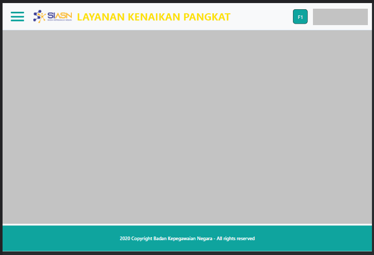

# Layout

Layout adalah custom component yang digunakan untuk
mengatur tata letak utama dari halaman website.
Layout ini terdiri dari Header dan Footer.

### Struktur Komponen

`Layout` memiliki struktur komponen sebagai berikut:

| Nama Komponen | Contoh Pemanggilan   Komponen                                             | Properti/Atribut     | Tipe Data   Atribut | Penjelasan                                                                 |
| ------------- | ----------------------------------------------------------------------------- | -------------------- | ----------------------- | -------------------------------------------------------------------------- |
| Layout        | `<Layout>`   &nbsp;&nbsp;&nbsp;&nbsp;&nbsp;`{children}`   `</Layout>` | `children component` | `Any`                   | Children Component adalah   komponen yang berada di dalam   Layout |
