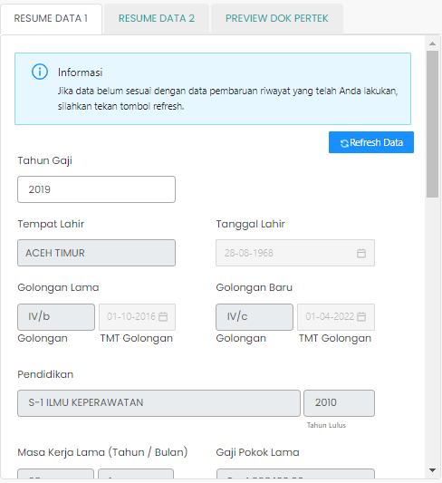

# Resume Data 1

Resume Data 1 berisi informasi tentang golongan ASN,
pendidikan terakhir ASN,
jabatan, masa kerja, serta lembaga tempat ASN
bekerja.

### Struktur Komponen

`ResumeData1` memiliki struktur komponen sebagai berikut:

| Nama Komponen | Contoh Pemanggilan   Komponen                                                                                                                                                                                           | Properti/Atribut | Tipe Data   Atribut | Penjelasan                                                                                                    |
| ------------- | --------------------------------------------------------------------------------------------------------------------------------------------------------------------------------------------------------------------------- | ---------------- | ----------------------- | ------------------------------------------------------------------------------------------------------------- |
| ResumeData1   | `<ResumeData1`   &nbsp;&nbsp;&nbsp;&nbsp;&nbsp;`dataUsulan=`   &nbsp;&nbsp;&nbsp;&nbsp;&nbsp;`{dataUsulan}`   &nbsp;&nbsp;&nbsp;&nbsp;&nbsp;`idUsul=`   &nbsp;&nbsp;&nbsp;&nbsp;&nbsp;`{idUsul}`   `/>` | `dataUsulan`     | `Object`                | Properti data usulan berisi informasi   data diri ASN, jenis layanan,   hingga dokumen-dokumen usulan |
|               |                                                                                                                                                                                                                             | `idUsul`         | `String`                | Properti id usul berisi nilai id dari usulan yang dikirim.                                                    |
