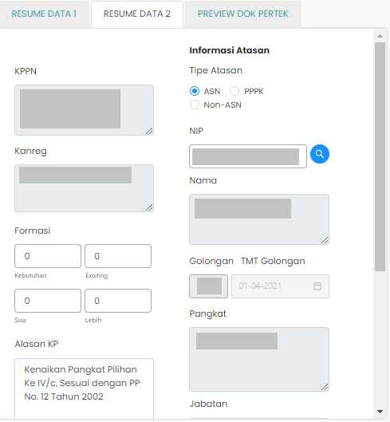

# Resume Data 2

Resume Data 2 berisi informasi tentang
Kantor Pelayanan Perbendaharaan Negara (KPPN),
atasan pada lembaga tempat ASN yang bersangkutan bekerja, serta
alasan kenaikan pangkat.
Resume Data 2 berada pada [Halaman Step-2](/validasi-usulan-kenaikan-pangkat/halaman-step-2 "Halaman Step-2").

### Struktur Komponen

`ResumeData2` memiliki struktur komponen sebagai berikut:

| Nama Komponen | Contoh Pemanggilan   Komponen                                                                                              | Properti/Atribut | Tipe Data   Atribut | Penjelasan                                                                                                    |
| ------------- | ------------------------------------------------------------------------------------------------------------------------------ | ---------------- | ----------------------- | ------------------------------------------------------------------------------------------------------------- |
| ResumeData2   | `<ResumeData2`   &nbsp;&nbsp;&nbsp;&nbsp;&nbsp;`dataUsulan=`   &nbsp;&nbsp;&nbsp;&nbsp;&nbsp;`{dataUsulan}`   `/>` | `dataUsulan`     | `Object`                | Properti data usulan berisi informasi   data diri ASN, jenis layanan,   hingga dokumen-dokumen usulan |
