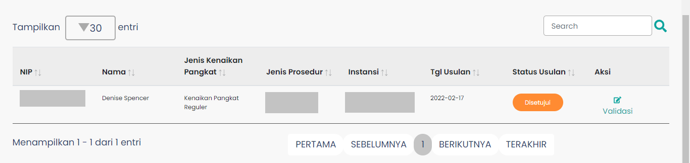

# Tabel Validasi Usulan

Tabel Validasi Usulan adalah komponen yang berada
pada halaman Validasi Usulan yang berguna untuk menampilkan
data usulan.

### Struktur Komponen

`TableVU` memiliki struktur komponen sebagai berikut:

| Nama Komponen | Contoh Pemanggilan   Komponen                                                                                                                                                            | Properti/Atribut | Tipe Data   Atribut | Penjelasan                                                                                                                                                                                                                                                   |
| ------------- | -------------------------------------------------------------------------------------------------------------------------------------------------------------------------------------------- | ---------------- | ----------------------- | ------------------------------------------------------------------------------------------------------------------------------------------------------------------------------------------------------------------------------------------------------------ |
| TableVU       | `<TableVU`   &nbsp;&nbsp;&nbsp;&nbsp; `dataTable={isSearch`   &nbsp;&nbsp;&nbsp;&nbsp; `? dataTable : data}`   &nbsp;&nbsp;&nbsp;&nbsp; `isLoading={loading}>`  `</TableVU>` | `dataTable`      | `Object`                | Properti dataTable memiliki   opsi berdasarkan   state isSearch, dimana jika   state isSearch bernilai true,   maka data yang ditampilkan adalah   data yang sesuai dengan   yang user cari dengan input   dari form cari usulan |
|               |                                                                                                                                                                                              | `isLoading`      | `Boolean`               | Properti isLoading adalah   boolean yang berfungsi untuk menentukan   proses loading dari pengambilan data   usulan yang nantinya akan   ditampilkan pada tabel validasi usulan.                                                             |
